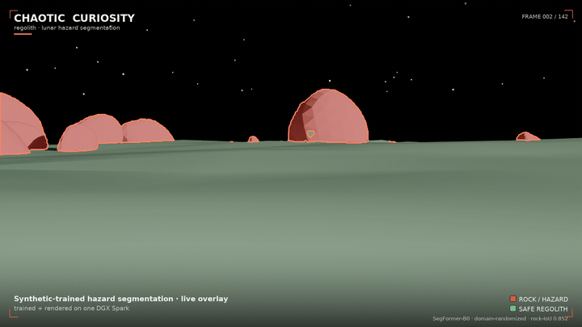

# regolith

Train a lunar hazard segmentation model on 100% synthetic data — no real labeled images, no GPU cluster, no guesswork. Everything runs on a single NVIDIA DGX Spark, from scene authoring through model training to a cinematic render that shows the model's predictions overlaid on a procedurally generated moonscape.

*A [Chaotic Curiosity](https://chaoticcuriosity.io) project by Don Balanzat — sibling to [chaotic-fine-tuning](https://github.com/chaoticcuriosity-io/chaotic-fine-tuning) (LLM fine-tuning on the same Spark) and [g1-humanoid-rl](https://github.com/chaoticcuriosity-io/g1-humanoid-rl) (humanoid robot RL).*

---

## The throughline

You want a rover or lander to *see* rocks and hazards on the Moon. The catch: real labeled images of the lunar surface are almost nonexistent, and none exist for the specific terrain or lighting conditions you care about.

The answer is to manufacture the data yourself. Render a photorealistic lunar scene in a simulator — you set every rock, control every shadow, and get pixel-perfect labels for free. Train a segmentation model on those synthetic images. Then measure how well it transfers to reality.

That loop — generate synthetic data, train, measure the transfer gap, close it — is the arc of this series, honestly told. Failures stay documented as lessons. Every "it works" comes with a number or an artifact.

---

## Start here

If you've never touched synthetic data pipelines or Omniverse, start at the primer:
**[`docs/reports/00-primer.md`](docs/reports/00-primer.md)** — what the problem is, what the tools are, and what you'll build.

Then follow the series in order (01 → 05) in [`docs/reports/`](docs/reports/).

To run anything yourself, see the ops manual: [`docs/dgx-spark-regolith-manual.md`](docs/dgx-spark-regolith-manual.md).

---

## What's here

| Path | What it does |
|------|-------------|
| `docs/reports/` | The learning series — six chapters, 00 through 05 |
| `scene/` | USD scene builder — regolith terrain, rocks, lighting, camera |
| `replicator/` | NVIDIA Omniverse Replicator pipeline — randomizers + dataset generator |
| `training/` | SegFormer fine-tuning — dataset loader, model, metrics, train loop |
| `eval/` | Evaluation on synthetic hold-out and real lunar imagery |
| `render/` | Cinematic RTX render with predicted segmentation overlaid |
| `scripts/` | Ops helpers — memory management (`free_memory.sh`), dataset assembly (`generate_all.sh`); per-step reproduce commands live in each chapter's `## Reproduce` block |
| `docs/` | GitHub Pages source + DGX Spark ops manual |

---

## The stack

| Layer | Tool |
|-------|------|
| Scene authoring | [OpenUSD](https://openusd.org) |
| Synthetic data generation | [NVIDIA Omniverse Replicator](https://developer.nvidia.com/omniverse/replicator) |
| Segmentation model | [SegFormer](https://huggingface.co/docs/transformers/model_doc/segformer) (HuggingFace Transformers) |
| Training framework | PyTorch |
| Rendering | NVIDIA Omniverse RTX renderer |
| Hardware | NVIDIA DGX Spark (GB10 Grace Blackwell, aarch64, CUDA 13, sm_121, 128 GB unified memory — nvidia-smi reports VRAM as N/A, which is expected) |

---

## Results

**Does domain randomization actually help?** Yes — measurably.

| Run | Frames | rock-IoU | vs no-DR |
|-----|-------:|:--------:|:--------:|
| no-DR (frozen appearance) | 750 | 0.689 | — |
| **DR, size-matched** | **750** | **0.788** | **+0.099** |
| DR-1500 (full set) | 1,500 | 0.815 | +0.126 |

Measured on `test_photoreal` — 300 frames with sun elevation, albedo, terrain, and camera parameters all shifted *outside* the training distribution. The size-matched comparison (`dr_750` vs `nodr_750`) isolates domain randomization from dataset size; the +0.099 gain is pure DR. DR beats no-DR on **267 of 300** test frames (mean per-frame rock-IoU gain: +0.0765). Per-frame results are committed to [`docs/reports/assets/ablation-perframe.json`](docs/reports/assets/ablation-perframe.json).

**Sim-to-real transfer** is partial. On 7 real Apollo lunar photographs (NASA public domain, Apollo 11–17, no ground truth available): the horizon/black-sky boundary and large real rocks transfer well — the hazard class fires on actual boulders. Fine regolith is over-segmented as rock; deep shadows are mislabeled as sky. DR consistently reduces false positives and largely removes the shadow-as-sky error, but both models exhibit the core gap. A rover-ready model needs real labeled lunar data in the loop.

**The render** is a 1920 × 1080 cinematic flythrough — a slow dolly-in toward a boulder field under a grazing 11° sun — with the deployed `dr_1500` model's predictions overlaid live on every frame (rock = red + outline, traversable regolith = green, sky untouched). 142 lit frames, 24 fps, 5.9 seconds, produced in full on the DGX Spark.

The full 1080p MP4 will be published as a GitHub Release asset. The GIF and web preview are in [`docs/reports/assets/`](docs/reports/assets/).

---

## Status

Series complete. All six chapters published.

| Chapter | Report |
|---------|--------|
| [00 — Primer](docs/reports/00-primer.md) | Synthetic data, sim-to-real gap, domain randomization, the DGX Spark |
| [01 — The lunar stage](docs/reports/01-the-lunar-stage.md) | USD scene: regolith heightfield, rock instancer, sun, dome, camera |
| [02 — Domain randomization](docs/reports/02-domain-randomization.md) | Replicator pipeline; 2,550 labeled frames across three splits |
| [03 — Training](docs/reports/03-training.md) | SegFormer fine-tuned on synthetic data; honest size-matched DR ablation |
| [04 — Sim-to-real](docs/reports/04-sim-to-real.md) | Transfer evaluation on 7 real Apollo photographs; gap measured |
| [05 — The render](docs/reports/05-the-render.md) | Cinematic 1920×1080 RTX flythrough with live hazard overlay |

Heavy artifacts (datasets, checkpoints, `.pt`, full-res `.mp4`) live on the DGX Spark, not in git. Reproduce commands are in each report's `## Reproduce` block.
