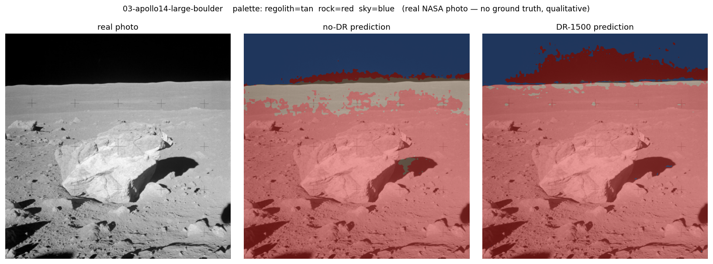

# regolith

Train a lunar hazard segmentation model on 100% synthetic data — then watch what happens when you make the synthetic data *more realistic*. We rebuilt the training rocks from crude low-poly blobs into photoreal basalt boulders. The synthetic benchmark went **up** (rock-IoU 0.815 → 0.852). The real-world transfer got **worse** — the model now floods ~83% of real Apollo regolith with false rock, up from ~52%. **Higher fidelity and higher synthetic scores did not buy better real transfer; they cost it.** This repo is the honest, reproducible story of that counter-intuitive result. Everything runs on a single NVIDIA DGX Spark, from scene authoring through model training to a cinematic render.

*A [Chaotic Curiosity](https://chaoticcuriosity.io) project by Don Balanzat — sibling to [chaotic-fine-tuning](https://github.com/chaoticcuriosity-io/chaotic-fine-tuning) (LLM fine-tuning on the same Spark) and [g1-humanoid-rl](https://github.com/chaoticcuriosity-io/g1-humanoid-rl) (humanoid robot RL).*

---

## The throughline

You want a rover or lander to *see* rocks and hazards on the Moon. The catch: real labeled images of the lunar surface are almost nonexistent, and none exist for the specific terrain or lighting conditions you care about.

The answer is to manufacture the data yourself. Render a photorealistic lunar scene in a simulator — you set every rock, control every shadow, and get pixel-perfect labels for free. Train a segmentation model on those synthetic images. Then measure how well it transfers to reality.

That loop — generate synthetic data, train, measure the transfer gap — is the arc of this series, honestly told. And the honest result is a surprise: the obvious upgrade (make the rocks photoreal) raised every synthetic score while making real-world behavior worse. Failures stay documented as lessons; this one is the headline. Every "it works" comes with a number or an artifact — and so does every "it doesn't."

---

## Start here

If you've never touched synthetic data pipelines or Omniverse, start at the primer:
**[`docs/reports/00-primer.md`](docs/reports/00-primer.md)** — what the problem is, what the tools are, and what you'll build.

Then follow the series in order (01 → 06) in [`docs/reports/`](docs/reports/).

To run anything yourself, see the ops manual: [`docs/dgx-spark-regolith-manual.md`](docs/dgx-spark-regolith-manual.md).

---

## What's here

| Path | What it does |
|------|-------------|
| `docs/reports/` | The learning series — seven chapters, 00 through 06 |
| `scene/` | USD scene builder — regolith terrain, rocks, lighting, camera |
| `replicator/` | NVIDIA Omniverse Replicator pipeline — randomizers + dataset generator |
| `training/` | SegFormer fine-tuning — dataset loader, model, metrics, train loop |
| `eval/` | Evaluation on synthetic hold-out and real lunar imagery |
| `render/` | Cinematic RTX render with predicted segmentation overlaid |
| `scripts/` | Ops helpers — memory management (`free_memory.sh`), dataset assembly (`generate_all.sh`); per-step reproduce commands live in each chapter's `## Reproduce` block |
| `docs/` | GitHub Pages source + DGX Spark ops manual |

---

## The stack

| Layer | Tool |
|-------|------|
| Scene authoring | [OpenUSD](https://openusd.org) |
| Synthetic data generation | [NVIDIA Omniverse Replicator](https://developer.nvidia.com/omniverse/replicator) |
| Segmentation model | [SegFormer](https://huggingface.co/docs/transformers/model_doc/segformer) (HuggingFace Transformers) |
| Training framework | PyTorch |
| Rendering | NVIDIA Omniverse RTX renderer |
| Hardware | NVIDIA DGX Spark (GB10 Grace Blackwell, aarch64, CUDA 13, sm_121, 128 GB unified memory — nvidia-smi reports VRAM as N/A, which is expected) |

---

## Results

**The synthetic numbers say we won.** We made the rocks photoreal and ran the honest size-matched domain-randomization ablation on `test_photoreal` — 300 frames with sun, albedo, terrain, and camera all shifted *outside* the training distribution. Every score rose versus the crude first build, and the deployed model hit its best-ever 0.852 rock-IoU.

| Run | Frames | rock-IoU (v2 realistic) | vs no-DR | v1 (blocky) |
|-----|-------:|:----------:|:--------:|:-----------:|
| no-DR (frozen appearance) | 750 | 0.8025 | — | 0.689 |
| **DR, size-matched** | **750** | **0.8486** | **+0.046** | 0.788 |
| DR-1500 (full set) | 1,500 | **0.8521** | +0.050 (vs no-DR, but size-matched +0.046 is the honest DR measure) | 0.815 |

The size-matched comparison (`dr_750` vs `nodr_750`) isolates domain randomization from dataset size; the +0.046 gain is pure DR. (Note it *shrank* from the crude build's +0.099 — realistic geometry raised the no-DR floor to 0.8025, leaving DR less to fix. More data saturated: +0.004 from 750 → 1,500.)

**The real numbers say we lost — worse than before.** On 7 real Apollo lunar photographs (NASA public domain, Apollo 11–17, no ground truth available), the photoreal model **floods** the frame: it labels **~83% of pixels rock** and only **~4% regolith**, up from ~52% rock on the crude build. The mechanism is the realism itself — photoreal rocks (rough, gray, bumpy) collapsed the rock-vs-regolith boundary toward "any rough gray texture is rock," and real lunar regolith is exactly that at photo resolution. Domain randomization, which *reduced* false rock on the crude build, now makes it worse on all 7 real frames. A new "rock-cloud" artifact hallucinates rock up into the black sky.

**Higher fidelity + higher synthetic score ≠ better real transfer.** Synthetic metrics — rendered by the same engine that made the training data — can flatter and mislead. The full v1→v2 story and the lesson are in [chapter 06](docs/reports/06-rock-fidelity.md).

**The render** is a 1920 × 1080 cinematic flythrough — a slow dolly-in toward a boulder field under a grazing 11° sun — with the deployed `dr_1500` model's predictions overlaid live on every frame (rock = red + outline, traversable regolith = green, sky untouched). The overlay is *clean* — but only because the scene is in-distribution: the synthetic regolith is the one the model learned to tell apart from rock. It is the same in-distribution flattery the 0.852 benchmark gives, which is exactly why the real-photo failure above is the reality check.

The full 1080p MP4 will be published as a GitHub Release asset. The GIF and web preview are in [`docs/reports/assets/`](docs/reports/assets/).

---

## Status

Series complete. All seven chapters published (realistic-rock "v2" build).

| Chapter | Report |
|---------|--------|
| [00 — Primer](docs/reports/00-primer.md) | Synthetic data, sim-to-real gap, domain randomization, the DGX Spark |
| [01 — The lunar stage](docs/reports/01-the-lunar-stage.md) | USD scene: regolith heightfield, realistic noise-displaced basalt rocks, sun, dome, camera |
| [02 — Domain randomization](docs/reports/02-domain-randomization.md) | Replicator pipeline; 2,550 labeled frames across three splits |
| [03 — Training](docs/reports/03-training.md) | SegFormer fine-tuned on synthetic data; honest size-matched DR ablation (+0.046; ceiling 0.8521) |
| [04 — Sim-to-real](docs/reports/04-sim-to-real.md) | Transfer on 7 real Apollo photographs — the model floods ~83% of real regolith as rock |
| [05 — The render](docs/reports/05-the-render.md) | Cinematic 1920×1080 RTX flythrough with live hazard overlay (clean, in-distribution) |
| [06 — Rock fidelity](docs/reports/06-rock-fidelity.md) | The v1→v2 evolution and the honest tradeoff: synthetic ↑, real ↓ |

Heavy artifacts (datasets, checkpoints, `.pt`, full-res `.mp4`) live on the DGX Spark, not in git. Reproduce commands are in each report's `## Reproduce` block.
