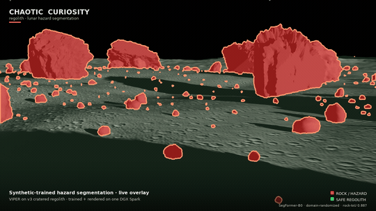

# Lunar hazard detection from synthetic data

You want a rover to see rocks. There are almost no labeled real images of the lunar surface. So you render the data yourself — perfect labels, zero annotation cost — and train a model on it.

That's the whole idea. This series shows you the full loop: build a USD scene, run NVIDIA Omniverse Replicator to generate a dataset with domain randomization, fine-tune a SegFormer, measure the transfer gap to real imagery, and render a cinematic final output. Everything runs on a single NVIDIA DGX Spark.

---

## Results — the failure, then the fix

First we made the synthetic **rocks** photoreal (v2). The synthetic benchmark went **up** (deployed rock-IoU 0.815 → 0.852) but real-world transfer got **worse**: the model **flooded** ~83% of real Apollo pixels with false rock (up from ~52%), because photoreal rocks (rough, gray, bumpy) collapsed the rock-vs-regolith boundary toward "any rough gray texture is rock" — and real lunar regolith is exactly that. That failure was a diagnosis: the fidelity was on the wrong surface.

So we moved it to the **ground** (v3) — a realistic cratered, dark, displaced, normal-mapped regolith floor, plus power-law rock sizes and harsh lunar lighting. With both rock and ground now rough inside the simulator, the texture shortcut no longer separates the classes, so the model had to learn shape, shadow, and scale — cues that transfer. **It worked:** synthetic rock-IoU rose to **0.887** and the real-photo flood **dropped to 35.7%**, below both prior builds. For the first time the synthetic and real arrows point the same way.

| Version | rocks | ground | synth rock-IoU | real flood |
|---------|-------|--------|:--------------:|:----------:|
| v1 | low-poly blobs | smooth heightfield | 0.815 | ~52% |
| v2 | photoreal basalt | smooth heightfield | 0.852 | ~83% |
| **v3** | power-law basalt | **cratered dark displaced** | **0.887** | **35.7%** |

The series closes with a 1920×1080 cinematic RTX flythrough of NASA's **VIPER** rover crossing the v3 boulder field — forward hazard-cam with the deployed model's predictions overlaid live, plus a third-person picture-in-picture. The overlay is clean *and* finally backed by a real-photo number that moved the right way.

---

## Start here

- [00 — Primer: synthetic data, sim-to-real, and why the Moon is a hard problem](reports/00-primer.md)

## The series

| Chapter | Topic |
|---------|-------|
| [01 — The lunar stage](reports/01-the-lunar-stage.md) | USD scene: terrain, realistic basalt rocks, lighting |
| [02 — Domain randomization](reports/02-domain-randomization.md) | Replicator pipeline + 2,550-frame labeled dataset |
| [03 — Training](reports/03-training.md) | SegFormer fine-tuning + honest size-matched DR ablation |
| [04 — Sim-to-real](reports/04-sim-to-real.md) | The v2 flood: ~83% of real regolith called rock |
| [05 — The render](reports/05-the-render.md) | Cinematic 1920×1080 RTX flythrough with live hazard overlay |
| [06 — Rock fidelity](reports/06-rock-fidelity.md) | The v1→v2 evolution and the failure: photoreal rocks worsened real transfer |
| [07 — Realistic ground](reports/07-realistic-ground.md) | **v3:** fidelity on the ground — synth 0.887, real flood 35.7%, VIPER render |

---

*A [Chaotic Curiosity](https://chaoticcuriosity.io) project by Don Balanzat — sibling to [chaotic-fine-tuning](https://github.com/chaoticcuriosity-io/chaotic-fine-tuning) (LLM fine-tuning on the same Spark) and [g1-humanoid-rl](https://github.com/chaoticcuriosity-io/g1-humanoid-rl) (humanoid robot RL).*
