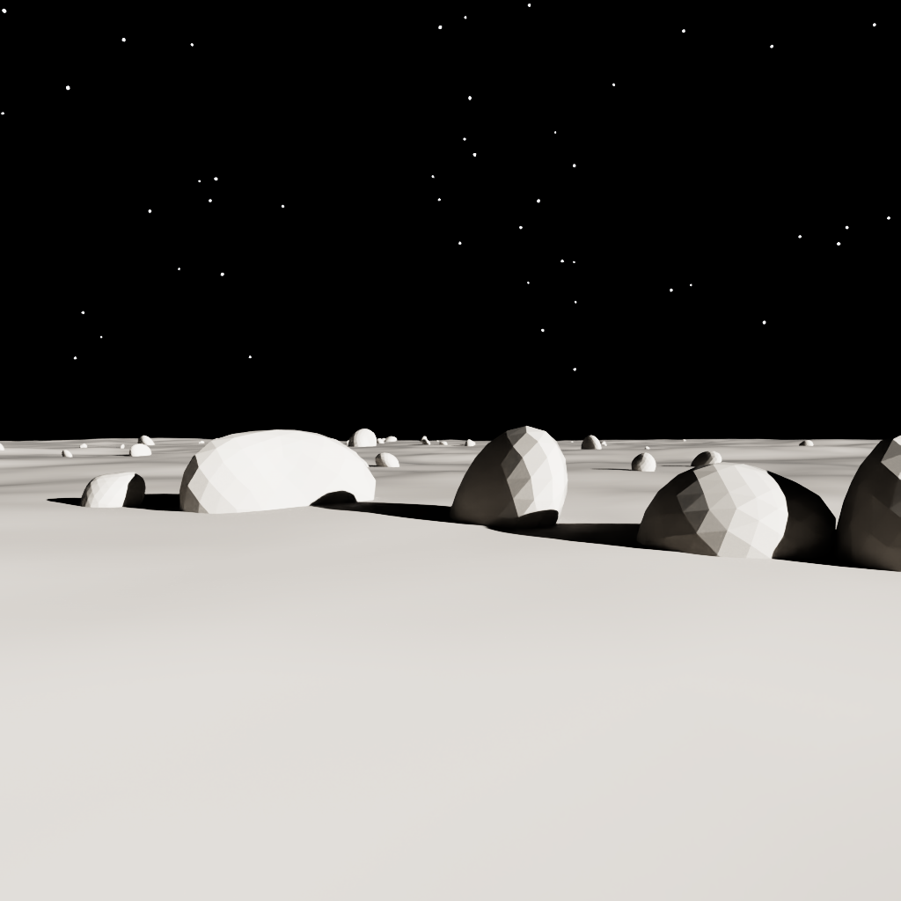
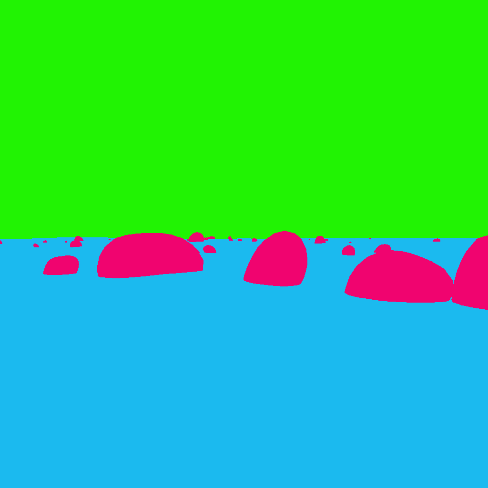

# 01 — The lunar stage

*Chaotic Curiosity | regolith series*

---

The primer explained why you need synthetic data. This chapter is where you actually build some. By the end you'll have a procedural lunar scene — regolith ground, a field of realistic noise-displaced basalt boulders, harsh low sun, near-black sky — and your first pixel-accurate 3-class segmentation mask. The reference frames at the bottom of this page are rendered at 512 × 512 (the resolution the training dataset is generated at) and came out of that exact run.

> **A note on what changed.** The rocks you see here are the *realistic* build (the second iteration). The first version of this scene used crude low-poly icospheres; chapter 06 tells the full story of why we rebuilt them as photoreal basalt — and the surprising sim-to-real cost that came with the upgrade. This chapter describes the rocks as they stand now.

---

## The scene at a glance

The scene lives in **OpenUSD** (Universal Scene Description) — the file format originally developed by Pixar that NVIDIA adopted as the lingua franca of Omniverse. A USD **stage** is a scenegraph: a hierarchy of **prims** (primitive nodes) that carry geometry, materials, transforms, and arbitrary metadata. When **NVIDIA Omniverse Replicator** renders the stage and asks "which class is this pixel?", the answer comes from **USD Semantics** — a metadata schema that lets you stamp any prim with a human-readable label. Tag the rock mesh `"rock"`, tag the ground `"regolith"`, tag the sky sphere `"sky"`, and Replicator's `BasicWriter` will emit a per-pixel label mask for free.

The whole scene is procedural — no external assets, no `omniverse://` URI lookups, no internet. Everything is generated from numpy and authored into the stage via `pxr` (the Python bindings to OpenUSD). That matters: it means you can run the scene builder anywhere the Isaac Sim container runs, with no asset registry and no network dependency.

The stage hierarchy looks like this:

```
/World/
  Regolith          — displaced ground mesh (heightfield + craters), class "regolith"
  Rocks/
    Rock_000 … Rock_N   — noise-displaced basalt boulders, class "rock"
  Sun               — UsdLux.DistantLight, harsh, low elevation
  StarDome          — large emissive near-black sphere, class "sky"
  Stars/
    Star_000 … Star_N   — tiny emissive spheres, class "sky"
  RoverCam          — UsdGeom.Camera at rover eye height
```

Let's walk each piece.

---

## The regolith ground

The ground is a 920 m x 920 m **heightfield** — a regular grid of 300 x 300 cells (roughly 3 m per cell) with each vertex displaced upward or downward by a noise function. You author it as a `UsdGeom.Mesh` with 90,601 vertices and 90,000 quads.

The elevation profile comes from **fBm** (**fractional Brownian motion**) value noise — five octaves stacked at increasing frequencies so you get both the broad undulations of real lunar terrain and finer surface texture on top. The primary amplitude is 3.2 m at the nominal scene — enough relief to read clearly in renders, exaggerated slightly from the relatively flat lunar mare.

On top of the fBm, the builder stamps **craters**: parabolic bowls with raised rims, placed at random positions across the terrain. The default scene (seed 42) gets 6–10 craters of 10–38 m radius. Inside each crater radius the ground dips as a parabola; just outside, a Gaussian bump forms the rim. It's not physically accurate to impact mechanics — it doesn't need to be. What it needs to do is vary local horizon lines so that lighting and shadow vary realistically across frames.

Per-vertex normals are computed from the height gradient (numpy's `gradient`) so the `UsdPreviewSurface` material shades correctly across the fBm surface. The material itself: `diffuseColor = (0.22, 0.20, 0.19)` — a warm gray close to the Apollo mare-regolith albedo — and `roughness = 0.96`, meaning nearly Lambertian scatter. Lunar regolith has almost no specular component; high roughness gets you there.

```python
_add_semantics(regolith_prim, "regolith")   # → canonical id 0
```

---

## The rocks (the hazard class)

Rocks are the class that matters most for rover safety — so they get the most geometric care. The scene scatters approximately 75–115 **noise-displaced basalt boulders** across the terrain, with 12 guaranteed near-field boulders to ensure the hazard class is always visible close to the camera. These are not the smooth low-poly blobs of the first build; they are irregular, eroded, sub-angular rocks, and the difference is what chapter 06 is about.

The base mesh is still an **icosphere** (a geodesic sphere), but the subdivision level now **scales with the rock's on-screen size**, via `_subdiv_for_scale`. A pebble a few pixels wide stays at subdivision-2 (162 vertices / 320 faces) — spending more polygons on it would be wasted. A large near-field boulder gets subdivision-4 (2,562 verts) and the biggest hero boulders subdivision-5 (10,242 verts / 20,480 faces), enough resolution that the displacement reads as fine pits and creases rather than facets. A full nominal scene runs on the order of ~0.7 M triangles.

The shape comes from **multi-octave 3-D value noise** displacing each vertex along its radial direction (`_displace_rock`). Four terms stack:

- **Coarse fBm lumps** — the overall blocky boulder form (4 octaves of 3-D fractional Brownian motion).
- **A ridged "facet" term** — `1 − |fBm|`, which turns noise valleys into sharp ridges, producing the angular creases and planar fracture faces of real broken basalt rather than smooth bulges.
- **Medium bumps** and **fine grain** — higher-frequency octaves that add surface texture down to the pit scale.

The noise domain is sampled **anisotropically per rock** (a random offset plus a per-axis stretch), so boulders come out elongated and individually distinct rather than spherical variations on one shape. Crucially, the displaced mesh is shaded with **smooth per-vertex normals** — face normals averaged into the shared vertices (`_vertex_normals`) — which is what dissolves the old visible facets into a continuous matte basalt surface.

The material is no longer a single gray. Rocks draw from a small **pool of 12 dark-basalt PBR materials** (`_make_rock_material_pool`): per-material base albedo in 0.058–0.130 (dark-to-medium basalt, deliberately **darker** than the 0.18–0.22 regolith), a faint warm-gray tint with per-channel jitter, and high roughness (0.85–0.97). Sharing a 12-material pool across the whole field gives tonal variety without authoring a unique shader per rock. All of these — per-rock albedo, roughness, and displacement amplitude — are domain-randomizable knobs (chapter 02).

Each rock still gets independent random scale, rotation, and XY placement. The scale is non-uniform (`sx`, `sy`, `sz` drawn separately, with `sz` biased to produce the flat-bottomed profiles typical of impact ejecta). Every rock is partially **embedded** in the regolith — sunk below the local terrain height, sampled by bilinear interpolation of the height grid — which prevents the "floating rock" artifact that signals a synthetic dataset immediately.

```python
_add_semantics(prim, "rock")   # → canonical id 1
```

Hold one fact for later: these rocks are *rough, gray, and bumpy* — and so, at photographic resolution, is real lunar regolith. That visual resemblance is exactly what comes back to bite the model in chapter 04.

---

## The sun

The sun is a `UsdLux.DistantLight` — a directional light at infinity, producing perfectly parallel rays with hard shadows. Three parameters define its character:

**Elevation 17°** above the horizon. Low. The Moon has no atmosphere to scatter or soften light, and missions to the lunar south pole operate at oblique illumination angles. At 17°, every rock casts a long shadow reaching toward the camera.

**Azimuth 120°** — roughly behind and to the right of the camera, which looks across the terrain in the +Y direction. The sun is never in frame. Long shadows sweep from rocks across the ground toward the lens.

**Intensity 14,000, angle 0.53°**. The angular size matches the sun's real apparent diameter (~0.53°), producing crisp, geometrically accurate shadow edges — no penumbra. Light color `(1.0, 0.97, 0.92)`: warm white, because without an atmosphere there's no Rayleigh scattering to tint it.

---

## The sky dome

The sky is a large emissive sphere — radius 600 m, centered on the scene — that the camera sees as background in every direction. Its material is authored **unlit** with a near-black emissive color `(0.01, 0.01, 0.016)`, meaning it emits that faint blue-black regardless of scene lighting. Stars are ~220 tiny emissive spheres placed on the dome's inner surface, biased toward the hemisphere the camera faces.

Both the dome mesh and the star spheres carry the `"sky"` semantic label:

```python
_add_semantics(dome_prim, "sky")       # → canonical id 2
_add_semantics(star.GetPrim(), "sky")  # → canonical id 2
```

---

## The camera

`/World/RoverCam` is a `UsdGeom.Camera` placed at `(0, -90, 2.0)` — 2.0 m eye height (rover/lander scale), 90 m behind the origin, looking across the terrain in the +Y direction. Focal length 20 mm on a 24 mm x 24 mm square sensor gives ~62° horizontal field of view. The camera tilts slightly downward (pitch ~-0.9°) to put near ground in frame.

---

## USD Semantics: the label infrastructure

The whole point of authoring the scene in USD, rather than rendering to a framebuffer and annotating manually, is that you can tag every prim at authoring time and get pixel-accurate labels for free. The tagging call:

```python
from isaacsim.core.utils.semantics import add_update_semantics
add_update_semantics(prim, semantic_label="rock", type_label="class")
```

tells Replicator's **SDG pipeline** (Synthetic Data Generation pipeline) that this prim belongs to class `"rock"`. At render time, the `BasicWriter` annotator traces each rendered pixel back to the prim that produced it and emits a mask image where the pixel value is the class id.

The canonical **class map** for this project:

| Class | Id | What it is |
|-------|----|------------|
| `regolith` | 0 | Safe ground — the traversable surface |
| `rock` | 1 | Hazard — what the model needs to detect |
| `sky` | 2 | Background — neither safe nor hazard |

Unlabeled or background pixels — anything Replicator couldn't assign to a prim with a semantic label — get **255** (`IGNORE_INDEX`). The training loop excludes these pixels from the loss. In a correctly built scene there should be zero of them.

---

## Reading the mask: raw ids vs. canonical ids

There's a subtlety worth knowing before you touch the output files. When `BasicWriter` writes a mask with `colorize_semantic_segmentation=False`, it emits **raw Replicator label ids** — not the canonical `{0, 1, 2}` map above. Replicator reserves ids 0 and 1 for its internal `BACKGROUND` and `UNLABELLED` slots and then assigns scene classes dynamically in the order it encounters them. For this scene the raw mapping ends up:

```
0 = BACKGROUND
1 = UNLABELLED
2 = sky
3 = rock
4 = regolith
```

You can't hardcode that — the numbering is an implementation detail that can change. The stable key is the class name string in the **labels JSON** that Replicator writes alongside every mask (`semantic_segmentation_labels_*.json`). The `canonical_mask_from_json()` function in `scene/build_lunar_stage.py` parses that JSON, matches class names (normalized `.strip().lower()`), and remaps the raw mask to the canonical `{0, 1, 2, 255}` values. The training pipeline, dataset loader, and metrics module all operate on canonical masks — the raw ids never appear outside this one translation step.

---

## The reference frames

The validated nominal scene: seed 42, 512 × 512. A single large noise-displaced basalt boulder dominates the near field — rough, pitted, sub-angular, sunk into the regolith — with smaller rocks scattered toward the horizon under a near-black starfield sky.



The corresponding 3-class segmentation mask, colorized with the project's fixed palette — tan = regolith, red = rock, blue = sky:



Approximate class coverage for this frame, read off the mask:

| Class | Id | Coverage |
|-------|----|----------|
| regolith | 0 | ≈ 37% |
| rock | 1 | ≈ 22% |
| sky | 2 | ≈ 41% |
| UNLABELED | 255 | 0% |

Rock reads at ≈ 22% here — well above the 1–8% typical of a training frame — because this reference is deliberately composed around one large near-field boulder. Zero unlabeled pixels, RGB mean 103.4 / p99 240 / max 249 — lit, not black. That's what a valid scene looks like.

---

## The gotchas (four real ones)

These issues came up during the actual build. Anyone working with Replicator's SDG pipeline on Isaac Sim 6.0 will encounter them.

### The singleton SDG annotator

The `semantic_segmentation` annotator lives **once** in the Replicator SDG pipeline — at `/Render/PostProcess/SDGPipeline/Replicator_semantic_segmentation`. Its `colorize` flag is **global**. If you attach a `colorize=False` writer (for the raw training mask) and a `colorize=True` writer (for a colorized preview) to the same render product simultaneously, the second writer silently flips the first's flag:

```
Annotator ... already attached. Modifying `colorize` from `False` to `True`
```

The raw mask is corrupted — label ids overwritten with RGB color values. The fix: two **sequential passes**. Pass A: attach `colorize=False` writer → step → poll-drain output files → detach. Pass B: attach `colorize=True` writer → step → poll-drain → detach. The `build_lunar_stage.py` `__main__` does exactly this. The poll-drain pattern (pumping `simulation_app.update()` while watching the output directory for PNG files) comes from Session 2: the first RTX frame on the Spark's GB10 takes ~150 s and a bare `wait_until_complete()` fires before the file lands.

### The sky dome occluding the sun

A `UsdLux.DistantLight` is at infinity. If you enclose the scene in a fully closed sphere, every shadow ray from the terrain surface hits the dome before reaching the sun — 100% shadowing, all-black scene. There are no highlights and no long shadows; only the emissive stars render.

The fix: cut a **spherical cap** out of the dome around the sun direction — a 34° conical hole in the sun-facing hemisphere. The builder skips any quad face whose centroid direction has a dot product with the sun direction above `cos(34°)`. Shadow rays from terrain now escape through the hole and reach the DistantLight.

The sun is at azimuth 120° — behind the camera, which looks toward azimuth ~0°. The hole sits ~118° off the camera's optical axis, well outside the ~44° half-diagonal frustum. The camera sees only dome, never through the hole.

### The Fresnel flare fix

Even after cutting the cap, rays passing through the hole at grazing angles hit the far interior of the dome. `UsdPreviewSurface` uses a metallic-roughness workflow with a hardcoded dielectric F0 of ~0.04 — and at grazing angles, the Fresnel term amplifies that to a bright specular highlight. The result: a gray patch at the horizon that reads as bright sky but doesn't match the near-black space background. Some pixels would be misclassified or look obviously synthetic.

The fix: author the sky dome material as **unlit**. Switching to `useSpecularWorkflow=1` and setting `specularColor=(0, 0, 0)` zeroes all specular response. The dome renders as its emissive color — flat near-black — regardless of any light that reaches it.

### The `Gf.Vec3f(numpy.float32)` cast

OpenUSD's Boost.Python bindings want **native Python floats**, not numpy scalars. Calling `Gf.Vec3f(np_float32_a, np_float32_b, np_float32_c)` raises `Boost.Python.ArgumentError`. The fix: `Gf.Vec3f(float(a), float(b), float(c))`. Note the asymmetry: `Vt.Vec3fArray` and `Vt.IntArray` *do* accept numpy arrays directly (used for the 90,601-vertex mesh) — it's the scalar constructors that need the explicit cast.

---

## Reproduce

```bash
# 1. Free memory on the Spark
ssh spark "bash /home/chaotic-curiosity/regolith/scripts/free_memory.sh"

# 2. Persistent dev container with warm shader cache
ssh spark "mkdir -p /home/chaotic-curiosity/regolith_cache /home/chaotic-curiosity/regolith_scene_out \
  && chmod 777 /home/chaotic-curiosity/regolith_cache /home/chaotic-curiosity/regolith_scene_out \
  && docker run -d --name isaac-dev --entrypoint bash --gpus all --network=host \
       -e ACCEPT_EULA=Y -e PRIVACY_CONSENT=Y \
       -v /home/chaotic-curiosity/regolith:/workspace/regolith:rw \
       -v /home/chaotic-curiosity/regolith_scene_out:/workspace/out:rw \
       -v /home/chaotic-curiosity/regolith_cache:/isaac-sim/.cache:rw \
       nvcr.io/nvidia/isaac-sim:6.0.0 -lc 'sleep infinity'"

# 3. Render one validation frame (seed 42, 1024x1024)
ssh spark "docker exec isaac-dev bash -lc \
  'rm -rf /workspace/out/labelid /workspace/out/preview; \
   SMOKE_OUT=/workspace/out /isaac-sim/python.sh \
   /workspace/regolith/scene/build_lunar_stage.py --seed 42 --out /workspace/out'"

# 4. Tear down and restart co-tenants
ssh spark "docker rm -f isaac-dev; docker start open-webui ollama-compose compose-arangodb-1"
```

Cold first frame: ~160 s (RTX shader compile on the GB10). Warm subsequent frames: ~21 s. The persistent shader-cache volume at `/isaac-sim/.cache` (chmod 777) eliminates the cold-start penalty on reruns.

---

## What you now understand

- A USD stage is a prim hierarchy; every prim can carry a USD Semantics class label that Replicator reads at render time.
- The scene is five components: a displaced fBm heightfield (regolith), a field of realistic noise-displaced basalt boulders (rocks — icosphere base, subdivision scaled by on-screen size, displaced by 3-D fBm lumps plus a ridged facet term, smoothed with per-vertex normals, shaded from a 12-material dark-basalt PBR pool), a `DistantLight` (the sun), an emissive near-black dome with a spherical-cap hole (sky), and a rover-height camera.
- The canonical class map is `{regolith: 0, rock: 1, sky: 2}`, with 255 as the ignore index for unlabeled pixels.
- Replicator writes raw label ids, not canonical ids — the labels JSON is the stable key; `canonical_mask_from_json()` does the remap.
- Four gotchas to carry forward: the singleton annotator (sequential passes), dome-occludes-sun (spherical cap), Fresnel flare (unlit sky material), and numpy-to-Gf scalar casting.

Continue to [02 — Domain randomization](02-domain-randomization.md).
