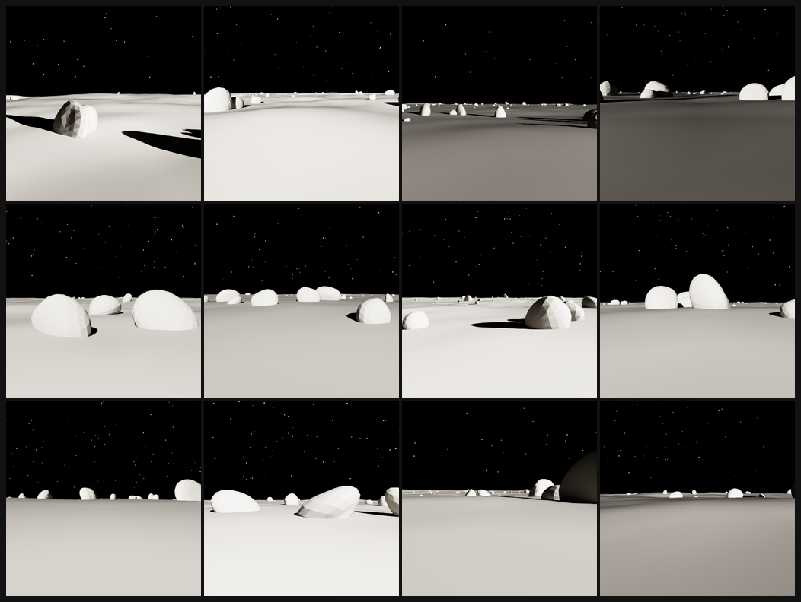

# 02 — Domain randomization

*Chaotic Curiosity | regolith series*

---

Chapter 01 gave you one validated lunar frame. A model trained on frames that all look like that — same sun angle, same albedo, same camera height — would fail the moment it met a scene that looked different. Chapter 02 is where you fix that: by deliberately breaking the consistency of the simulator.

---

## Why domain randomization bridges the sim-to-real gap

The **sim-to-real gap** (introduced in the primer) is the performance drop you'll measure in chapter 04 when a model trained on synthetic renders meets real imagery. The root cause is **distributional mismatch**: the model learns cues that are specific to the renderer — one lighting setup, one surface color, one camera height — and those cues don't transfer to the real world, where no two photographs look alike.

**Domain randomization** is the standard fix. Instead of fixing every visual parameter to one value, you randomize the *appearance* of the simulator across a wide range for every frame. Sun elevation bounces between 5° and 40°. Albedo varies from dark basaltic mare to bright highland regolith. The camera floats from 1.5 m to 2.7 m off the ground. Every frame looks plausibly lunar but never exactly like the last one.

The idea: if the model never sees the same appearance twice, it can't memorize renderer artifacts. What it *does* see consistently — across all those varied appearances — is what actually distinguishes rock from regolith from sky: the geometric and tonal relationships that hold in the real world too. That's what transfers.

The claim that domain randomization helps will be tested empirically in chapter 04 using the ablation described below. For now, you're building the evidence.

---

## The architecture: params-driven scene + per-frame sampler

The scene builder (`scene/build_lunar_stage.py`) is params-driven. Every domain-randomizable parameter — sun, material, terrain, camera — is a key in a `params` dict. `build_lunar_stage(seed, params)` reads that dict and builds the scene accordingly; any key the caller omits falls back to the validated nominal defaults from chapter 01.

`replicator/randomizers.py` provides `sample_params(rng, cfg)` — the function that draws a fresh `params` dict for each frame from a YAML config. Two families of knobs:

**Scalar knobs** get one fresh uniform draw per frame: sun elevation, sun azimuth, sun intensity, regolith albedo, regolith roughness, terrain amplitude, embedding depth, camera height, camera pitch, camera FOV, star count.

**Range pass-through knobs** are handed to the scene builder as `(lo, hi)` ranges rather than single values: crater count, rock count, rock scale, near-rock scale, near-rock placement band. The builder draws the actual per-element values internally from a dedicated RNG seeded by the frame's seed. This means rock *layout* still varies frame-to-frame even in the no-DR ablation control — only the *appearance* is frozen.

The output of `sample_params` is a JSON-serializable dict of Python `float`/`int` scalars — recorded verbatim in the dataset `manifest.json` so every frame's domain parameters are reproducible.

---

## The DR knobs: real ranges from `train_dr.yaml`

Every randomized knob and its actual range in the main training split, with the reasoning behind each bound:

### Lighting

| Knob | Range | Notes |
|------|-------|-------|
| Sun elevation | 5°–40° | Grazing to mid — long hard shadows. The Moon has no atmosphere; low sun is the norm at the poles. Above 40° the scene flattens and the shadows shorten. |
| Sun azimuth | 100°–260° | Rear/side hemisphere only — see caveat below. |
| Sun intensity | 9,000–20,000 | Varies scene contrast from murky to harshly lit. |

### Surface

| Knob | Range | Notes |
|------|-------|-------|
| Regolith albedo | 0.10–0.28 | Dark basaltic mare to medium-bright highland — the real range of Apollo sample albedos. |
| Regolith roughness | 0.85–0.99 | Stays firmly in the high-roughness / near-Lambertian regime. |
| Terrain amplitude | 2.0–4.8 m | Slightly flatter to more rugged than the nominal 3.2 m. |
| Crater count | 5–12 per frame | Randint, upper bound exclusive. |

### Geometry (rocks)

| Knob | Range | Notes |
|------|-------|-------|
| Rock count | 70–119 per frame | Far-field scatter density. |
| Rock scale (far-field) | 0.28–1.35 m | Pebbles to boulders. |
| Rock scale (near-field) | 1.1–3.0 m | The 12 guaranteed near-field boulders. |
| Near-rock Y band | -80 to -46 m | How close the near boulders sit to the camera. |
| Embedding depth | 0.22–0.42 fraction | How deep rocks sink into the regolith surface. |

### Rock appearance (new in the realistic build)

The photoreal basalt rocks of chapter 01 carry their own randomizable look, drawn per-rock from a shared 12-material pool:

| Knob | Range | Notes |
|------|-------|-------|
| Rock albedo | 0.058–0.130 | Per-rock grayscale base, dark-to-medium basalt — deliberately **darker** than the regolith. |
| Rock roughness | 0.85–0.97 | Uniformly matte/dusty; no specular highlights. |
| Rock displacement amplitude | ~0.34 nominal | How irregular/eroded the noise displacement makes each boulder. |

### Camera

| Knob | Range | Notes |
|------|-------|-------|
| Camera height | 1.5–2.7 m | Low rover to tall lander eye height. |
| Camera pitch | -5.0° to +1.5° | Slight downward tilt to nearly level gaze. |
| Camera FOV | 52°–72° | Tighter to wider lens — compresses or expands apparent rock size. |

### Sky

| Knob | Range |
|------|-------|
| Star count | 160–300 |

---

## Two real caveats

### Sun azimuth is constrained to [100°, 260°]

A full 360° azimuth sweep seemed like the obvious choice. It broke the dataset. When the sun swings toward the +Y direction — the camera's forward direction — the 34° spherical-cap hole in the sky dome (the opening that lets the DistantLight reach the terrain, introduced in chapter 01) enters the camera frustum. The camera sees through the hole to empty void — pixels with no prim behind them — and Replicator marks those pixels `BACKGROUND`, which remaps to the ignore index 255. The small-batch validation frames showed 8–36% unlabeled pixels at certain azimuths.

The fix: constrain azimuth to [100°, 260°]. The camera looks toward azimuth ~0°; this range keeps the sun in the rear/side hemisphere, with the dome hole always at least ~57° off the camera's optical axis — safely outside the frustum even at the widest-FOV corner case. After the fix: all 30 small-batch frames had zero unlabeled pixels.

The trade-off: all training frames have back or side lighting. Front-lit scenes are not represented in the training distribution. That's an honest limitation of this procedural-dome approach — not a bug, but a boundary condition worth knowing when you evaluate chapter 04.

### RGB is DLSS-upscaled from ~256² to 512²

The RTX renderer's `RayTracedLighting` mode internally renders at approximately 256 x 256 when the output resolution is set to 512 x 512, then uses **DLSS** (Deep Learning Super Sampling) to upscale. The log says it plainly:

```
DLSS ... Render resolution of (256, 256) is below minimal input resolution of 300
```

The semantic segmentation mask is **not** DLSS-upscaled — it's generated at the native 512 x 512 from exact prim coverage, not from the upscaled image. Masks are always pixel-accurate. The RGB images are mildly softened — sub-pixel edges slightly blurred — acceptable for a synthetic training set, and arguably a small regularizer against texture overfitting. If crisper RGB is ever needed, DLSS can be disabled or the render resolution raised explicitly.

The practical upside: DLSS makes RTX subframes nearly free. The difference between 3 subframes (training bulk, ~1.5 s/frame warm) and 12 subframes (test set quality, ~1.7 s/frame) is essentially noise in the wall-clock budget.

---

## The no-DR ablation control (`train_nodr.yaml`)

Domain randomization only means something if you can show that removing it hurts. `train_nodr.yaml` provides the ablation: the domain is frozen to a single nominal appearance — sun at 22° elevation, azimuth 120°, intensity 14,000; regolith albedo 0.18, roughness 0.94; terrain amplitude 3.2 m; camera at 2.0 m height, -0.9° pitch, 62° FOV — while the scene *content* still varies per frame across the same ranges as the DR split. Rock count, rock layout, crater placement, and terrain noise all differ from frame to frame. Only the look is fixed. 750 frames, same base seed as `train_dr`.

Training a model on `train_nodr` and comparing it against one trained on `train_dr`, both evaluated on `test_photoreal`, is the controlled experiment. The no-DR model has seen the same rock shapes and terrain topologies; the only thing it missed was variation in how they *look*. Chapter 03 trains both models; chapter 04 measures the gap.

---

## The domain-gap test set (`test_photoreal.yaml`)

`test_photoreal` is the held-out evaluation split, designed to probe generalization outside the training domain. Every domain knob is shifted into a range neither training split ever saw:

| Knob | Train DR range | Test photoreal range |
|------|---------------|---------------------|
| Sun elevation | 5°–40° | 42°–70° |
| Sun intensity | 9k–20k | 20k–32k |
| Regolith albedo | 0.10–0.28 | 0.28–0.42 |
| Regolith roughness | 0.85–0.99 | 0.70–0.85 |
| Terrain amplitude | 2.0–4.8 m | 4.8–7.0 m |
| Camera height | 1.5–2.7 m | 2.5–3.6 m |
| Camera FOV | 52°–72° | 70°–85° |

The rocks are also different: fewer (40–89 per frame), larger (far-field scale 0.5–2.2 m, near-field 1.8–4.0 m). Some test frames have near-field boulders that fill a substantial portion of the image — rock fraction can reach 53% in extreme cases, vs. a typical 1–8% in the training split. Rendered at 12 RTX subframes (vs. 3 for training) for the cleanest possible evaluation imagery. Seed 7777 — entirely independent of the training seed.

A model that memorized training-domain appearance will degrade here. A domain-randomized model should hold up better. That contrast is what chapter 04 measures.

---

## The gallery: what domain randomization looks like in practice

Twelve frames sampled from the live `train_dr` generation — spread across seeds and parameter draws:



Each cell is a different appearance of the same underlying problem. The rocks are the realistic noise-displaced basalt boulders from chapter 01 — rough, pitted, sub-angular. Sun elevation and direction vary visibly: some frames have long raking shadows from the left, others shorter shadows from above and behind. Albedo spans from nearly-black basalt to mid-gray highland. Rock density swings from a sparse scatter to a boulder-strewn foreground. The camera height differences are subtle but affect how much sky vs. ground dominates the frame.

Every one of these has a paired pixel-accurate segmentation mask in `train_dr/mask/` on the Spark — same filename stem, values in `{0, 1, 2}`. That's the training signal.

---

## The rock fraction problem

Rock coverage across the small-batch validation (20 training frames): regolith ~49%, rock mean ~3.8% (range 1.0–7.9%), sky ~46%. Rock is the minority class by roughly 10–50x. A model trained naively on this data would be incentivized to predict "regolith" everywhere and achieve decent overall accuracy — but zero useful hazard detection.

The training pipeline (chapter 03) addresses this with **class weighting** — up-weighting the rock class in the cross-entropy loss in proportion to its underrepresentation. The exact weighting strategy is the chapter 03 topic. The point here is that the imbalance is a known, documented property of the dataset, not a surprise.

---

## The full dataset

| Split | Frames | Mode | Subframes | What varies |
|-------|--------|------|-----------|-------------|
| `train_dr` | 1,500 | DR | 3 | Everything |
| `train_nodr` | 750 | no-DR | 3 | Content only (rock layout, terrain noise); appearance frozen |
| `test_photoreal` | 300 | DR (unseen ranges) | 12 | Everything, outside training bounds |
| **Total** | **2,550** | | | |

Generated on the DGX Spark at ~1.5–1.7 s/frame warm (subframes=3), ~75 min wall-clock for all three splits. Datasets live at `/home/chaotic-curiosity/regolith_data/{train_dr,train_nodr,test_photoreal}/` — not in git (heavy binary artifacts). Each split's `manifest.json` records the class map, per-frame seed and params, and aggregate class fractions.

---

## Reproduce

```bash
# 0. Persistent dev container (warm shader cache; co-tenants left running — 103 GiB free during gen)
ssh spark "mkdir -p /home/chaotic-curiosity/regolith_data && chmod 777 /home/chaotic-curiosity/regolith_data \
  && docker run -d --name isaac-dev --entrypoint bash --gpus all --network=host \
       -e ACCEPT_EULA=Y -e PRIVACY_CONSENT=Y \
       -v /home/chaotic-curiosity/regolith:/workspace/regolith:rw \
       -v /home/chaotic-curiosity/regolith_data:/workspace/data:rw \
       -v /home/chaotic-curiosity/regolith_cache:/isaac-sim/.cache:rw \
       nvcr.io/nvidia/isaac-sim:6.0.0 -lc 'sleep infinity'"

# 1. Launch all three splits (detached; chains sequentially in the container)
ssh spark "docker exec -d isaac-dev bash -lc '
  cd /workspace/regolith
  /isaac-sim/python.sh replicator/generate_dataset.py \
    --config replicator/configs/train_dr.yaml \
    --n 1500 --out /workspace/data/train_dr --seed 42 --res 512 \
    >> /workspace/data/gen.log 2>&1
  /isaac-sim/python.sh replicator/generate_dataset.py \
    --config replicator/configs/train_nodr.yaml \
    --n 750 --out /workspace/data/train_nodr --seed 42 --res 512 \
    >> /workspace/data/gen.log 2>&1
  /isaac-sim/python.sh replicator/generate_dataset.py \
    --config replicator/configs/test_photoreal.yaml \
    --n 300 --out /workspace/data/test_photoreal --seed 7777 --res 512 \
    >> /workspace/data/gen.log 2>&1'"

# 2. Check progress (one-liner)
ssh spark "cat /home/chaotic-curiosity/regolith_data/{train_dr,train_nodr,test_photoreal}/progress.txt 2>/dev/null"
```

---

## What you now understand

- Domain randomization varies the *appearance* of the simulator — lighting, albedo, camera — while holding the *task* constant. The model sees the same rock-vs-regolith-vs-sky problem under wildly varied conditions, so it can't overfit to any one appearance.
- The pipeline is: `sample_params(rng, cfg)` draws a params dict from a YAML config → `build_lunar_stage(seed, params)` builds the scene → `BasicWriter` writes RGB + mask → `canonical_mask_from_json()` remaps → saved `rgb/` + `mask/` files.
- Two honest trade-offs: sun azimuth constrained to [100°, 260°] (procedural-dome limitation — side/back lighting only), and RGB is DLSS-upscaled from ~256² while masks are exact at 512².
- The no-DR control (`train_nodr`) trains on the same content distribution under a fixed appearance — the ablation that will prove domain randomization matters in chapter 04.
- `test_photoreal` uses unseen sun elevation, albedo, roughness, terrain, and camera parameters — the domain-gap stress test.
- Rock class fraction runs 1–8% across training frames — the imbalance is real and will be up-weighted in the loss.

Continue to [03 — Training the model](03-training.md).
