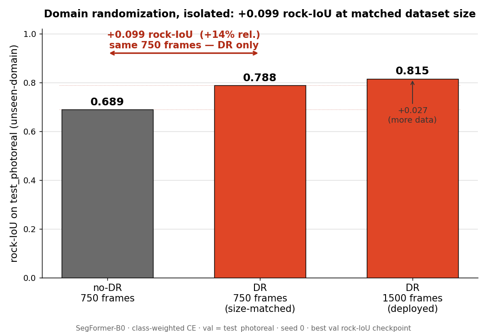

# 03 — Training the model

*Chaotic Curiosity | regolith series*

---

Chapter 02 produced three labeled datasets — rendered on the realistic basalt rocks of chapter 01: a 1,500-frame **domain-randomized** training set, a 750-frame no-DR control where only the *appearance* is frozen, and a 300-frame unseen-domain test set (`test_photoreal`). This chapter turns those pixels into a model — and then runs the experiment the whole series has been building toward: **does domain randomization actually help, when you hold everything else equal?**

The answer, measured: **+0.046 rock-IoU** at matched dataset size. That is a real gain — but it is *smaller* than the +0.099 the cruder first-build rocks produced, and the reason why is the seed of this whole series' punchline. The realistic rocks lifted every score: the no-DR baseline jumped from 0.689 to **0.8025**, so there was simply less gap left for domain randomization to close. This chapter explains what these numbers mean, how they were earned, and — just as importantly — why a higher synthetic score is about to mislead us.

---

## What "training" means here: fine-tuning, not from scratch

You do not teach a network to see from nothing. That would need millions of images and weeks of compute. Instead you start from a model that already knows what edges, textures, and shapes look like, and you *adjust* it for your specific task. That adjustment is **fine-tuning** — continuing to train a model whose weights were already learned on a large general dataset, using a much smaller task-specific dataset.

The general knowledge comes from **transfer learning**: the idea that features learned on one task carry over to another. Our model's visual "prior" comes from **ImageNet** — a 1.2-million-image classification dataset of everyday objects (dogs, cars, mushrooms). A network trained on ImageNet learns a hierarchy of reusable visual features in its early layers: oriented edges, then textures, then object parts. None of those are lunar, but *edges are edges* — the low-level machinery transfers cleanly to rock-vs-regolith boundaries. We keep that machinery and retrain the parts that decide "rock or not."

The model is **SegFormer** — a semantic-segmentation architecture built on a **Mix Transformer (MiT)** backbone. We use its smallest variant, **SegFormer-B0** (HuggingFace id `nvidia/mit-b0`), chosen in chapter 00's plan for three reasons: it is fast to fine-tune on a 3-class problem, its hierarchical transformer reads multi-scale texture (pebble to boulder) better than a same-size convolutional backbone, and its low inference latency suits eventual onboard deployment.

One subtlety worth naming: we load the **MiT encoder** (the ImageNet-pretrained half that extracts features) but throw away SegFormer's original output head and bolt on a **fresh decode head** sized for our 3 classes. The encoder starts smart; the head starts random and learns `{regolith, rock, sky}` from scratch on our data. In `training/model.py`, `ignore_mismatched_sizes=True` is exactly the flag that permits this transplant.

---

## The rare-class problem: why the loss has to be weighted

A segmentation model is trained by a **loss function** — a number that measures how wrong each prediction is, which the optimizer drives downward. The default for classification is **cross-entropy loss**: per pixel, how much probability mass did the model put on the correct class?

Plain cross-entropy has a fatal flaw on this dataset. Recall from chapter 02 that **rock** — the hazard class, the entire point of the system — covers only **1–8%** of pixels in a typical training frame; regolith and sky split the rest. A model minimizing average per-pixel loss discovers a cheap shortcut: predict "regolith" or "sky" almost everywhere, eat the small penalty on the rare rock pixels, and still post a low average loss. It would score high on overall accuracy and detect *no hazards*. That is the worst possible failure mode for a rover.

The fix is **class-weighted cross-entropy**: multiply each class's contribution to the loss by a weight inversely proportional to how common it is, so a mistake on a rare rock pixel costs far more than a mistake on common regolith. `training/train.py` computes these weights from the actual pixel counts of each training split (inverse frequency, normalized to sum to 3). The result for every run lands at roughly:

| Class | Pixel share | Loss weight |
|-------|-------------|-------------|
| regolith | dominant | ~0.20 |
| **rock** | **1–8%** | **~2.59** |
| sky | dominant | ~0.20 |

A rock pixel carries about **13×** the loss weight of a regolith pixel. That is what forces the model to take the hazard class seriously instead of averaging it away.

Two more pieces complete the loss: pixels labeled **255** (the **ignore index** — background or unlabeled, see chapter 01) are excluded from the loss entirely, and **rock-IoU** (not overall accuracy, not mean-IoU) is the metric used to pick the best checkpoint. **IoU** — *intersection over union* — measures predicted-rock pixels that are truly rock, divided by the union of predicted and true rock. It is the honest score for a rare class: predicting "regolith everywhere" scores an IoU of **0** on rock, no matter how high the overall accuracy. We save the checkpoint with the highest **validation** rock-IoU and report that number.

---

## The training configuration

Every run is identical except for the training data — that is the whole design. The shared recipe:

| Setting | Value | Why |
|---------|-------|-----|
| Model | SegFormer-B0 (`nvidia/mit-b0`) | Smallest SegFormer; ImageNet MiT encoder + fresh 3-class head |
| Loss | Class-weighted CE, `ignore_index=255` | Rock up-weighted ~13× (above) |
| Optimizer | AdamW, peak **lr 6e-5** | SegFormer paper's fine-tuning rate |
| LR schedule | Cosine decay to 1e-7 | Smooth anneal over the run |
| Batch size | 8 | Fits comfortably in the Spark's unified memory |
| Validation split | **`test_photoreal`** | Unseen-domain synthetic — the generalization probe |
| Early stopping | patience **8** on val rock-IoU | Stop once it stops improving (max 40 epochs) |
| Seed | 0 | Same initialization and data order across runs |
| Hardware | DGX Spark (GB10), NGC `pytorch:26.03-py3`, `transformers` | ~16–31 s/epoch |

Using `test_photoreal` as the validation set is deliberate: we are not measuring how well each model fits its *own* training distribution (every model fits its own data well — see the overfitting evidence below). We are measuring how well it **generalizes to a domain it never trained on**. That is the number that predicts real-world behavior.

---

## The honest ablation: hold dataset size constant

Here is where most "domain randomization works!" claims quietly cheat. The deployed DR set has **1,500** frames; the no-DR control has **750**. Compare those two directly and you have changed *two* things at once — the randomization **and** twice the data. Any improvement is confounded: you cannot tell how much came from DR and how much came from simply training on more images.

So we run a **size-matched ablation** — the controlled experiment that isolates the variable you care about. Three runs:

1. **`nodr_750`** — the no-DR control. 750 frames, appearance frozen.
2. **`dr_750`** — domain-randomized, but **truncated to the same 750 frames**. On the Spark this split is literally the first 750 frames of the 1,500-frame DR set, symlinked — same generation, same seed lineage, just cut to match the control's count.
3. **`dr_1500`** — the full deployed DR set, 1,500 frames.

Now the comparisons separate cleanly:

- **`dr_750` vs `nodr_750`** isolates **domain randomization** — identical size (750), identical content distribution (chapter 02 showed both vary rock layout and terrain the same way); the *only* difference is whether appearance was randomized. This is the headline.
- **`dr_1500` vs `dr_750`** isolates **dataset size** — identical method (DR), 750 → 1,500 frames. This is the secondary, "more data" effect.

Comparing 1,500-vs-750 would have inflated the apparent DR benefit by smuggling in the data-size gain. The size-matched design refuses that shortcut.

---

## Results

All three runs, best validation checkpoint on `test_photoreal`:

| Run | Frames | DR? | rock-IoU | best epoch |
|-----|-------:|:---:|:--------:|:----------:|
| `nodr_750` | 750 | no | **0.8025** | 18 |
| `dr_750` | 750 | **yes** | **0.8486** | 19 |
| `dr_1500` | 1,500 | yes | **0.8521** | 13 |

For the deployed `dr_1500` checkpoint, the full per-class breakdown is **regolith 0.9556 / rock 0.8521 / sky 0.9730**, mIoU **0.9269**.

Read the two effects straight off the table:

- **Domain randomization, size-matched:** rock-IoU **0.8025 → 0.8486 = +0.046 absolute (+5.7% relative)**, with dataset size held fixed at 750. Pure DR.
- **More data, DR held fixed:** rock-IoU **0.8486 → 0.8521 = +0.004** going from 750 to 1,500 frames. Effectively flat — the curve has **saturated**. Doubling the data bought almost nothing.

Two things changed from the cruder first build, and both matter. First, every number is higher: the realistic basalt geometry is simply easier to learn and to generalize from, lifting the no-DR baseline from 0.689 all the way to **0.8025**. Second — and this is the consequence — the **DR gain shrank**, from +0.099 to **+0.046**, and the more-data gain all but vanished (+0.004). When the floor rises that far, there is less room left above it for either lever to add. Regolith (0.9556) and sky (0.9730) are at ceiling; what little headroom remains is in **rock**, the one class that matters for not destroying a wheel.



The full numeric table — including the v1-vs-v2 comparison and the independent verification pass — is committed alongside the figures at [`assets/ablation-results.json`](assets/ablation-results.json). The `dr_1500` global IoU was re-derived in a fresh inference pass over all 300 test frames straight from the saved checkpoint — rock-IoU **0.8520**, mIoU **0.9269** — matching the training-time number (0.8521) to three decimals, so the inference path is faithful.

---

## Why the DR gain shrank: the floor came up

The mechanism is the same one domain randomization always fights — **overfitting to a frozen appearance** — but the realistic rocks changed the size of the prize.

In the cruder first build, the no-DR model had a soft target to memorize: smooth, low-poly rocks under one fixed lighting were easy to overfit and brittle to generalize, so the no-DR baseline languished at 0.689 and DR's anti-memorization pressure bought a full **+0.099**. The realistic basalt rocks are a richer, more varied signal in their *own* geometry — every boulder is a distinct eroded shape — so even a no-DR model trained on them generalizes much better to the unseen-domain test set (0.689 → **0.8025**). Realistic geometry, it turns out, does part of the job domain randomization used to do alone.

That is why the size-matched DR gain fell to **+0.046**: there was less brittleness left to fix. And it is why more data saturated almost immediately (**+0.004** from 750 → 1,500) — once the model has learned generalizable rock-ness from realistic shapes, additional frames of the same kind add little. Both observations point the same way: **fidelity and domain randomization are partly redundant levers.** Raise one and the other has less to contribute.

Read at face value, this is good news, and the table says so: realistic rocks plus DR give the highest synthetic rock-IoU this project has produced, **0.8521**. If the story ended at the synthetic benchmark, "we made the rocks photoreal and the number went up" would be the headline.

The story does not end at the synthetic benchmark.

---

## The caveat that matters: this is still synthetic

Read the headline precisely. The +0.046 gain — and the 0.8521 ceiling it sits under — is measured on **`test_photoreal`**, a synthetic, held-out, **unseen-domain** split. Chapter 02 built it specifically to sit *outside* the training distribution: brighter sun (42°–70° elevation vs 5°–40°), higher albedo, rougher terrain, wider lenses, bigger and fewer rocks. So this is a real and demanding generalization test — the model predicts on lighting, materials, and geometry it never trained on.

But `test_photoreal` is still rendered by the **same simulator** that made the training data. It is **synthetic → synthetic** transfer. It is *not yet* the question the whole series exists to answer: does any of this survive contact with a **real lunar photograph**, taken by a real camera, of real regolith, under a real sun? That is the **sim-to-real gap**, and it is measured — honestly, with real imagery — in chapter 04.

And here is the trap we are walking into with our eyes open. We made the rocks photoreal; the synthetic score rose to 0.8521, the best in the project. The natural inference — *better fidelity, better number, therefore better model* — is the one chapter 04 is about to break. The realistic rocks are rough, gray, and bumpy. So is real lunar regolith at photographic resolution. A model trained to call "rough gray bumpy texture" rock learned something that scores beautifully on synthetic rocks and **catastrophically over-fires on real soil**. The 0.8521 is real. It is also about to mislead us. Turn the page.

---

## Reproduce

All three runs, on the Spark, inside the training container (`regolith-train`, NGC `pytorch:26.03-py3` with `transformers`). Datasets at `/workspace/datasets/`, code mounted at `/workspace/regolith`:

```bash
# 0. Size-matched DR split = first 750 frames of train_dr, symlinked
ssh spark "mkdir -p /home/chaotic-curiosity/regolith_data/train_dr_750/{rgb,mask}
  cd /home/chaotic-curiosity/regolith_data/train_dr_750
  for i in \$(seq -f '%05g' 0 749); do
    ln -sf ../../train_dr/rgb/rgb_\$i.png  rgb/rgb_\$i.png
    ln -sf ../../train_dr/mask/mask_\$i.png mask/mask_\$i.png
  done"

# 1. no-DR control (750)
ssh spark "docker exec regolith-train bash -lc \
  'cd /workspace/regolith && python training/train.py \
     --train-split /workspace/datasets/train_nodr \
     --val-split   /workspace/datasets/test_photoreal \
     --epochs 40 --lr 6e-5 --batch 8 --seed 0 --patience 8 \
     --out /workspace/regolith/outputs/runs/nodr_750'"

# 2. DR, size-matched (750)
ssh spark "docker exec regolith-train bash -lc \
  'cd /workspace/regolith && python training/train.py \
     --train-split /workspace/datasets/train_dr_750 \
     --val-split   /workspace/datasets/test_photoreal \
     --epochs 40 --lr 6e-5 --batch 8 --seed 0 --patience 8 \
     --out /workspace/regolith/outputs/runs/dr_750'"

# 3. DR, full deployed set (1500)
ssh spark "docker exec regolith-train bash -lc \
  'cd /workspace/regolith && python training/train.py \
     --train-split /workspace/datasets/train_dr \
     --val-split   /workspace/datasets/test_photoreal \
     --epochs 40 --lr 6e-5 --batch 8 --seed 0 --patience 8 \
     --out /workspace/regolith/outputs/runs/dr_1500'"
```

Each run writes `best.pt`, `metrics.jsonl` (per-epoch curves), and `summary.json` (final numbers) to its output dir. Checkpoints stay on the Spark — they are heavy binaries, excluded from git. The figures and the results table in `docs/reports/assets/` are the committed artifacts.

---

## What you now understand

- **Fine-tuning** adapts a model that already learned general vision via **transfer learning** from **ImageNet**; we keep SegFormer-B0's MiT encoder and train a fresh 3-class decode head.
- The **rock** class is 1–8% of pixels, so plain cross-entropy would ignore it; **class-weighted cross-entropy** up-weights rock ~13× and **rock-IoU** (not accuracy) selects the best checkpoint.
- The **size-matched ablation** (`dr_750` vs `nodr_750`, both 750 frames) isolates domain randomization from dataset size — the honest comparison that 1500-vs-750 would have confounded.
- On the realistic rocks, **domain randomization adds +0.046 rock-IoU (+5.7%) at matched size** (0.8025 → 0.8486); doubling the data on top adds only +0.004 (0.8486 → 0.8521) — the curve has saturated. The deployed `dr_1500` ceiling is **0.8521** (regolith 0.9556 / rock 0.8521 / sky 0.9730).
- The DR gain is **smaller than the +0.099 the cruder rocks gave**, because realistic geometry raised the no-DR baseline from 0.689 to 0.8025. Fidelity and domain randomization are partly **redundant** levers — raise one and the other has less left to add.
- **This is still a synthetic unseen-domain test**, and the higher synthetic score is about to be a trap: a model that learned "rough gray bumpy = rock" scores beautifully on photoreal synthetic rocks and is primed to over-fire on real regolith. The real sim-to-real gap is chapter 04.

Continue to [04 — Sim-to-real](04-sim-to-real.md).
