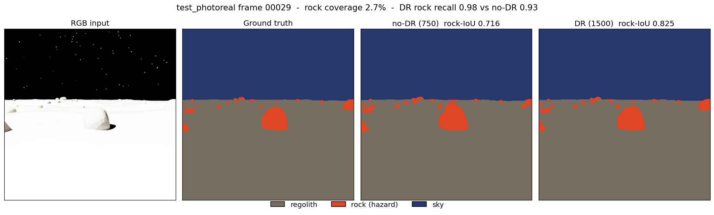
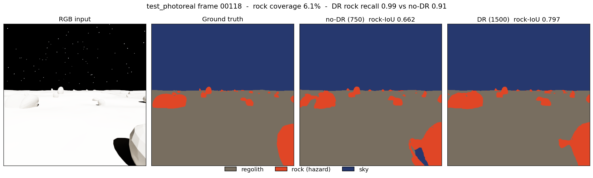
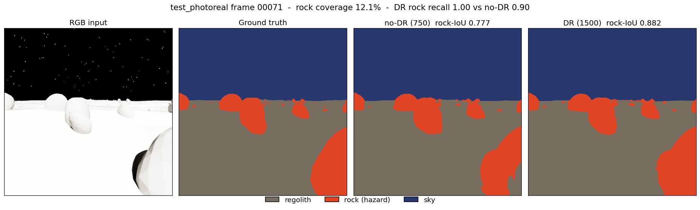
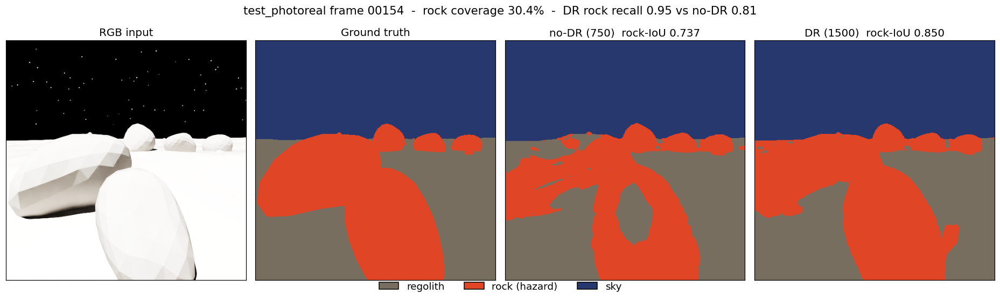

# 03 — Training the model

*Chaotic Curiosity | regolith series*

---

Chapter 02 produced three labeled datasets: a 1,500-frame **domain-randomized** training set, a 750-frame no-DR control where only the *appearance* is frozen, and a 300-frame unseen-domain test set (`test_photoreal`). This chapter turns those pixels into a model — and then runs the experiment the whole series has been building toward: **does domain randomization actually help, when you hold everything else equal?**

The answer, measured: **+0.099 rock-IoU** at matched dataset size. This chapter explains what that number means, how it was earned, and — just as importantly — what it does *not* yet prove.

---

## What "training" means here: fine-tuning, not from scratch

You do not teach a network to see from nothing. That would need millions of images and weeks of compute. Instead you start from a model that already knows what edges, textures, and shapes look like, and you *adjust* it for your specific task. That adjustment is **fine-tuning** — continuing to train a model whose weights were already learned on a large general dataset, using a much smaller task-specific dataset.

The general knowledge comes from **transfer learning**: the idea that features learned on one task carry over to another. Our model's visual "prior" comes from **ImageNet** — a 1.2-million-image classification dataset of everyday objects (dogs, cars, mushrooms). A network trained on ImageNet learns a hierarchy of reusable visual features in its early layers: oriented edges, then textures, then object parts. None of those are lunar, but *edges are edges* — the low-level machinery transfers cleanly to rock-vs-regolith boundaries. We keep that machinery and retrain the parts that decide "rock or not."

The model is **SegFormer** — a semantic-segmentation architecture built on a **Mix Transformer (MiT)** backbone. We use its smallest variant, **SegFormer-B0** (HuggingFace id `nvidia/mit-b0`), chosen in chapter 00's plan for three reasons: it is fast to fine-tune on a 3-class problem, its hierarchical transformer reads multi-scale texture (pebble to boulder) better than a same-size convolutional backbone, and its low inference latency suits eventual onboard deployment.

One subtlety worth naming: we load the **MiT encoder** (the ImageNet-pretrained half that extracts features) but throw away SegFormer's original output head and bolt on a **fresh decode head** sized for our 3 classes. The encoder starts smart; the head starts random and learns `{regolith, rock, sky}` from scratch on our data. In `training/model.py`, `ignore_mismatched_sizes=True` is exactly the flag that permits this transplant.

---

## The rare-class problem: why the loss has to be weighted

A segmentation model is trained by a **loss function** — a number that measures how wrong each prediction is, which the optimizer drives downward. The default for classification is **cross-entropy loss**: per pixel, how much probability mass did the model put on the correct class?

Plain cross-entropy has a fatal flaw on this dataset. Recall from chapter 02 that **rock** — the hazard class, the entire point of the system — covers only **1–8%** of pixels in a typical training frame; regolith and sky split the rest. A model minimizing average per-pixel loss discovers a cheap shortcut: predict "regolith" or "sky" almost everywhere, eat the small penalty on the rare rock pixels, and still post a low average loss. It would score high on overall accuracy and detect *no hazards*. That is the worst possible failure mode for a rover.

The fix is **class-weighted cross-entropy**: multiply each class's contribution to the loss by a weight inversely proportional to how common it is, so a mistake on a rare rock pixel costs far more than a mistake on common regolith. `training/train.py` computes these weights from the actual pixel counts of each training split (inverse frequency, normalized to sum to 3). The result for every run lands at roughly:

| Class | Pixel share | Loss weight |
|-------|-------------|-------------|
| regolith | dominant | ~0.20 |
| **rock** | **1–8%** | **~2.59** |
| sky | dominant | ~0.20 |

A rock pixel carries about **13×** the loss weight of a regolith pixel. That is what forces the model to take the hazard class seriously instead of averaging it away.

Two more pieces complete the loss: pixels labeled **255** (the **ignore index** — background or unlabeled, see chapter 01) are excluded from the loss entirely, and **rock-IoU** (not overall accuracy, not mean-IoU) is the metric used to pick the best checkpoint. **IoU** — *intersection over union* — measures predicted-rock pixels that are truly rock, divided by the union of predicted and true rock. It is the honest score for a rare class: predicting "regolith everywhere" scores an IoU of **0** on rock, no matter how high the overall accuracy. We save the checkpoint with the highest **validation** rock-IoU and report that number.

---

## The training configuration

Every run is identical except for the training data — that is the whole design. The shared recipe:

| Setting | Value | Why |
|---------|-------|-----|
| Model | SegFormer-B0 (`nvidia/mit-b0`) | Smallest SegFormer; ImageNet MiT encoder + fresh 3-class head |
| Loss | Class-weighted CE, `ignore_index=255` | Rock up-weighted ~13× (above) |
| Optimizer | AdamW, peak **lr 6e-5** | SegFormer paper's fine-tuning rate |
| LR schedule | Cosine decay to 1e-7 | Smooth anneal over the run |
| Batch size | 8 | Fits comfortably in the Spark's unified memory |
| Validation split | **`test_photoreal`** | Unseen-domain synthetic — the generalization probe |
| Early stopping | patience **8** on val rock-IoU | Stop once it stops improving (max 40 epochs) |
| Seed | 0 | Same initialization and data order across runs |
| Hardware | DGX Spark (GB10), NGC `pytorch:26.03-py3`, `transformers` | ~16–31 s/epoch |

Using `test_photoreal` as the validation set is deliberate: we are not measuring how well each model fits its *own* training distribution (every model fits its own data well — see the overfitting evidence below). We are measuring how well it **generalizes to a domain it never trained on**. That is the number that predicts real-world behavior.

---

## The honest ablation: hold dataset size constant

Here is where most "domain randomization works!" claims quietly cheat. The deployed DR set has **1,500** frames; the no-DR control has **750**. Compare those two directly and you have changed *two* things at once — the randomization **and** twice the data. Any improvement is confounded: you cannot tell how much came from DR and how much came from simply training on more images.

So we run a **size-matched ablation** — the controlled experiment that isolates the variable you care about. Three runs:

1. **`nodr_750`** — the no-DR control. 750 frames, appearance frozen.
2. **`dr_750`** — domain-randomized, but **truncated to the same 750 frames**. On the Spark this split is literally the first 750 frames of the 1,500-frame DR set, symlinked — same generation, same seed lineage, just cut to match the control's count.
3. **`dr_1500`** — the full deployed DR set, 1,500 frames.

Now the comparisons separate cleanly:

- **`dr_750` vs `nodr_750`** isolates **domain randomization** — identical size (750), identical content distribution (chapter 02 showed both vary rock layout and terrain the same way); the *only* difference is whether appearance was randomized. This is the headline.
- **`dr_1500` vs `dr_750`** isolates **dataset size** — identical method (DR), 750 → 1,500 frames. This is the secondary, "more data" effect.

Comparing 1,500-vs-750 would have inflated the apparent DR benefit by smuggling in the data-size gain. The size-matched design refuses that shortcut.

---

## Results

All three runs, best validation checkpoint on `test_photoreal`:

| Run | Frames | DR? | rock-IoU | mIoU | regolith IoU | rock IoU | sky IoU | best epoch | wall time |
|-----|-------:|:---:|:--------:|:----:|:-----------:|:--------:|:-------:|:----------:|:---------:|
| `nodr_750` | 750 | no | **0.689** | 0.863 | 0.928 | 0.689 | 0.973 | 9 | 278 s |
| `dr_750` | 750 | **yes** | **0.788** | 0.903 | 0.947 | 0.788 | 0.974 | 23 | 507 s |
| `dr_1500` | 1,500 | yes | **0.815** | 0.914 | 0.952 | 0.815 | 0.975 | 27 | 1,024 s |

Read the two effects straight off the table:

- **Domain randomization, size-matched:** rock-IoU **0.689 → 0.788 = +0.099 absolute (+14% relative)**, with dataset size held fixed at 750. Pure DR.
- **More data, DR held fixed:** rock-IoU **0.788 → 0.815 = +0.027** going from 750 to 1,500 frames. Real, but roughly a third the size of the DR effect.

Notice *where* the gains land. Regolith IoU (0.928 → 0.952) and sky IoU (0.973 → 0.975) were already excellent and barely move — those classes are easy. Almost the entire improvement concentrates in **rock**, the one class that matters for not destroying a wheel. Domain randomization buys you precisely the capability you were trying to buy.


The full numeric table, including the independent verification pass, is committed alongside the figures at [`assets/ablation-results.json`](assets/ablation-results.json). Those global IoU numbers were re-derived in a fresh inference pass over all 300 test frames straight from the saved checkpoints — `nodr_750` recomputed to rock-IoU 0.6885 / mIoU 0.8629, `dr_1500` to 0.8147 / 0.9139 — matching the training-time numbers to the third decimal. The overlays below come from that same faithful pass, so what you see is genuinely what the deployed weights predict.

---

## What the overlays show

Aggregate IoU is a single number; it hides *how* a model fails. To see the difference, we ran the no-DR-750 and DR-1500 checkpoints on four `test_photoreal` frames spanning the rock-coverage range — sparse far-field scatter to a boulder-dominated foreground — and laid them side by side: **RGB input | ground truth | no-DR prediction | DR-1500 prediction**, with the project's fixed palette (regolith gray, **rock red**, sky blue).

A sparse field (2.7% rock). The no-DR model catches the big near-field boulder but under-segments the small rocks strung along the horizon; DR fills more of them in. Rock recall rises 0.93 → 0.98.



A medium scatter (6.1% rock). The most revealing failure on this frame: the no-DR model punches a hole of **sky** (blue) straight through a bright near-field boulder at lower right — it mistakes a sunlit rock face for background. DR labels the whole boulder correctly as rock. This is exactly the appearance-overfitting DR is meant to cure: the no-DR model only ever saw rocks under one lighting, so a brightly lit rock confuses it.



A denser mid-field (12.1% rock). The no-DR model leaves gaps where ground truth has rock; DR closes them, lifting rock recall 0.90 → 1.00 on this frame.



A boulder-dominated foreground (30.4% rock). The no-DR prediction is fragmented — it carves a regolith-colored hole into the interior of the large central boulder and breaks its edges into noise. DR renders it as one solid rock mass that tracks ground truth closely. Rock recall 0.81 → 0.95.



**An honest note on frame selection.** These four were chosen to be *legible* — frames where the difference is large enough to see at a glance — and they span the rock-coverage range rather than clustering at one density. Their per-frame DR gains (+0.10 to +0.14 rock-IoU) sit somewhat above the **+0.0765 mean per-frame gain** across all 300 test frames (all 300 frames contain rock in ground truth — no NaN exclusions), precisely because the most visible cases are above-average ones. They are not the extreme outliers either (a handful of frames swing +0.3 to +0.5). And the effect is not universal: DR beats no-DR on **267 of 300** frames, ties or trails on the other 33. Per-frame results are committed to [`assets/ablation-perframe.json`](assets/ablation-perframe.json). The overlays illustrate the direction and character of the improvement; the table and bar chart carry the rigorous magnitude.

---

## Why no-DR loses: it memorizes the look

The training curves expose the mechanism. The no-DR model reached its best validation rock-IoU at **epoch 9** — where its **training** rock-IoU was **0.830** but its **validation** rock-IoU was only **0.689**, a 0.141 generalization gap. Its validation loss was already *climbing* (0.368 → 0.402) while its training loss collapsed toward 0.04. That is the textbook signature of **overfitting**: the model is memorizing the one frozen appearance of its training set, not learning rock-ness. Early stopping halted it at epoch 17.

The domain-randomized model never gets that chance. Its **first epoch** already scored validation rock-IoU **0.712** — *above the no-DR model's best-ever 0.689* — and it kept genuinely improving until epoch 27, because randomized appearance gives it nothing to memorize. The signal it can fit is the part that generalizes: geometry, shadow, the tonal relationship between rock and ground. The cost is wall-clock — DR runs train longer before they stop improving (1,024 s vs 278 s) — which is a cheap price for the capability.

---

## The caveat that matters: this is still synthetic

Read the headline precisely. The +0.099 gain is measured on **`test_photoreal`** — a synthetic, held-out, **unseen-domain** split. Chapter 02 built it specifically to sit *outside* the training distribution: brighter sun (42°–70° elevation vs 5°–40°), higher albedo, rougher terrain, wider lenses, bigger and fewer rocks. So this is a real and demanding generalization test — the model is predicting on lighting, materials, and geometry it never trained on, and DR's advantage there is exactly the point.

But `test_photoreal` is still rendered by the **same simulator** that made the training data. It is **synthetic → synthetic** transfer. It is *not yet* the question the whole series exists to answer: does any of this survive contact with a **real lunar photograph**, taken by a real camera, of real regolith, under a real sun? That is the **sim-to-real gap**, and it is measured — honestly, with real imagery — in chapter 04. Domain randomization just earned +0.099 rock-IoU on an unseen synthetic domain. Whether that buys anything on actual lunar pixels is a separate, harder claim, and we have not made it yet.

---

## Reproduce

All three runs, on the Spark, inside the training container (`regolith-train`, NGC `pytorch:26.03-py3` with `transformers`). Datasets at `/workspace/datasets/`, code mounted at `/workspace/regolith`:

```bash
# 0. Size-matched DR split = first 750 frames of train_dr, symlinked
ssh spark "mkdir -p /home/chaotic-curiosity/regolith_data/train_dr_750/{rgb,mask}
  cd /home/chaotic-curiosity/regolith_data/train_dr_750
  for i in \$(seq -f '%05g' 0 749); do
    ln -sf ../../train_dr/rgb/rgb_\$i.png  rgb/rgb_\$i.png
    ln -sf ../../train_dr/mask/mask_\$i.png mask/mask_\$i.png
  done"

# 1. no-DR control (750)
ssh spark "docker exec regolith-train bash -lc \
  'cd /workspace/regolith && python training/train.py \
     --train-split /workspace/datasets/train_nodr \
     --val-split   /workspace/datasets/test_photoreal \
     --epochs 40 --lr 6e-5 --batch 8 --seed 0 --patience 8 \
     --out /workspace/regolith/outputs/runs/nodr_750'"

# 2. DR, size-matched (750)
ssh spark "docker exec regolith-train bash -lc \
  'cd /workspace/regolith && python training/train.py \
     --train-split /workspace/datasets/train_dr_750 \
     --val-split   /workspace/datasets/test_photoreal \
     --epochs 40 --lr 6e-5 --batch 8 --seed 0 --patience 8 \
     --out /workspace/regolith/outputs/runs/dr_750'"

# 3. DR, full deployed set (1500)
ssh spark "docker exec regolith-train bash -lc \
  'cd /workspace/regolith && python training/train.py \
     --train-split /workspace/datasets/train_dr \
     --val-split   /workspace/datasets/test_photoreal \
     --epochs 40 --lr 6e-5 --batch 8 --seed 0 --patience 8 \
     --out /workspace/regolith/outputs/runs/dr_1500'"
```

Each run writes `best.pt`, `metrics.jsonl` (per-epoch curves), and `summary.json` (final numbers) to its output dir. Checkpoints stay on the Spark — they are heavy binaries, excluded from git. The figures and the results table in `docs/reports/assets/` are the committed artifacts.

---

## What you now understand

- **Fine-tuning** adapts a model that already learned general vision via **transfer learning** from **ImageNet**; we keep SegFormer-B0's MiT encoder and train a fresh 3-class decode head.
- The **rock** class is 1–8% of pixels, so plain cross-entropy would ignore it; **class-weighted cross-entropy** up-weights rock ~13× and **rock-IoU** (not accuracy) selects the best checkpoint.
- The **size-matched ablation** (`dr_750` vs `nodr_750`, both 750 frames) isolates domain randomization from dataset size — the honest comparison that 1500-vs-750 would have confounded.
- **Domain randomization adds +0.099 rock-IoU (+14%) at matched size**; doubling the data on top adds a further +0.027. The gains land almost entirely on the hazard class; regolith and sky were already near-ceiling.
- The mechanism is visible in the curves: the no-DR model **overfits** its single frozen appearance (train rock-IoU 0.830 vs val 0.689), while the DR model's first epoch already beats no-DR's best because randomized appearance gives it nothing to memorize.
- The overlays confirm the character of the win — DR recovers bright boulders the no-DR model mislabels as sky and fills rocks it drops — across 267 of 300 frames.
- **This is still a synthetic unseen-domain test.** The real sim-to-real gap, measured against actual lunar imagery, is chapter 04.

Continue to [04 — Sim-to-real](04-sim-to-real.md).
