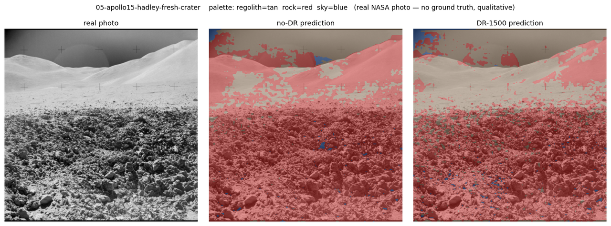

# 04 — Sim-to-real

*Chaotic Curiosity | regolith series*

---

Every number in this series so far has been measured on pixels a computer drew. Chapter 03 ended on the best one the project has produced: a SegFormer-B0 trained purely on domain-randomized synthetic renders — now of **photoreal basalt rocks** — scored **0.8521 rock-IoU** on `test_photoreal`, a synthetic split built to sit *outside* the training distribution. That is higher than the cruder first build managed (0.815). By every synthetic measure, making the rocks realistic made the model better.

This chapter spends the credibility, and it is where the series turns. We point the deployed model — the `dr_1500` checkpoint, weights frozen — at **real photographs of the Moon**, taken on real film by astronauts standing on the actual surface, and we look honestly at what it does. No retraining, no cherry-picking. And what it does is worse than before. The more realistic, higher-scoring model **floods real lunar regolith with false rock** — calling roughly **83% of every real Apollo frame "rock"**, up from about 52% in the first build. The synthetic number went up; the real-world behavior went down. That is the result this whole series exists to report, and the rest of the chapter is the evidence and the mechanism.

---

## What "sim-to-real" actually means here

A model trained on synthetic data learns whatever is *consistent* in that data. Some of what's consistent is real physics — a rock occludes the ground behind it, a sunlit slope is brighter than its shadow, the horizon cuts a hard line against black sky. That part transfers. But some of what's consistent is an *artifact of the renderer* — the exact texture statistics of the synthetic surfaces, the particular way the path tracer rolls off a shadow, the fact that the sky is always mathematically pure black. The model has no way to tell physics from artifact. It fits both.

The **sim-to-real gap** is what you see when the artifacts stop holding. And in the realistic-rock build there is a new, sharper version of the gap — one that the photoreal upgrade *created*. To see why, hold two facts side by side:

1. The realistic rocks of chapter 01 are **rough, gray, bumpy, matte** — noise-displaced basalt, dark albedo, high roughness, covered in pits and creases.
2. Real lunar **regolith**, photographed at the resolution of an Apollo Hasselblad frame, is *also* rough, gray, bumpy, and matte — a fractal clutter of clods, micro-craters, and grain.

In the synthetic world those two classes are still separable, because the renderer draws regolith as a comparatively smooth displaced heightfield and rocks as the bumpy basalt. But the model didn't learn "rock = basalt mesh." It learned the *appearance* that distinguished the two in renders — and the most salient cue it latched onto was **rough gray bumpy texture = rock**. On real film, where the soil itself carries exactly that texture, the cue misfires everywhere at once. The boundary the model drew between rock and regolith collapsed toward "any rough gray texture is rock," and real regolith walked straight across it.

---

## The synthetic ceiling, reproduced

First, a sanity check. `eval/eval_synth.py` loads a checkpoint and runs it over a labeled synthetic split, accumulating per-class confusion counts globally (the same way training did) so the number is directly comparable to chapter 03. Running the `dr_1500` checkpoint over all 300 frames of `test_photoreal`:

| Metric | Value |
|--------|------:|
| rock-IoU (global) | **0.8520** |
| mIoU (global) | 0.9269 |
| regolith IoU | 0.9556 |
| rock IoU | 0.8520 |
| sky IoU | 0.9730 |

That reproduces chapter 03's headline (0.8521) to three decimals from the saved weights — so the inference path used for the real images below (ImageNet normalization, SegFormer logits upsampled H/4 → 512² before argmax) is faithful. The committed numbers are in [`assets/eval-synth-dr1500.json`](assets/eval-synth-dr1500.json). **This 0.8520 is the ceiling, and it is higher than the first build's 0.8147.** Watch what it is worth on real pixels.

---

## The real images

We curated **7 real, public-domain lunar surface photographs** from the NASA Image and Video Library, spanning five missions — **Apollo 11, 14, 15, 16, and 17** — and downloaded them over plain HTTPS. Every frame was chosen to *match the training viewpoint*: ground-level, rocky regolith, horizon, black sky, harsh single-source shadows. We deliberately avoided frames dominated by astronauts, the lander, the rover, flags, or Earth — the three-class model (`{regolith, rock, sky}`) was never trained on those objects, so scoring it on them would be a rigged test. The set is one **color** frame (Apollo 17) and six **black-and-white** frames, and includes both horizon-with-sky compositions and down-looking terrain-filling ones. Full citations, NASA IDs, and public-domain status are in [`eval/real_images/sources.md`](../../eval/real_images/sources.md). It is the *same* seven frames the first build was tested on — which is exactly the point: only the rocks changed, so any change in behavior is the realism's doing.

Then the hard rule: **there is no ground truth for these images.** Nobody hand-labeled every pixel of AS11-40-5881 as regolith, rock, or sky. So we report **no IoU on the real images** — computing one would mean inventing a ground-truth mask and grading against our own guess, which is exactly the kind of number this series refuses to print. The real-image evaluation is **qualitative**: colored overlays you can inspect yourself, with the canonical palette (regolith = tan, **rock = red**, sky = blue). `eval/eval_real.py` letterboxes each photo to 512², runs both the `dr_1500` and `nodr_750` checkpoints, and lays them side by side: **real photo | no-DR prediction | DR-1500 prediction**. We can still count *how many pixels of each class* a model predicts, even without ground truth — and that count is where the story is.

> **The Kaggle cross-domain number, honestly skipped.** The plan allowed a bonus *quantitative* real-image score using the labeled "Artificial Lunar Landscape" dataset (Chang'e-3-derived masks) via `eval/data/download_real.py`. That dataset requires Kaggle credentials, and there were none on the Spark. Per the plan we did **not** attempt interactive auth — so there is no quantitative cross-domain IoU in this chapter. The fetch-and-map code remains in place for a credentialed run.

---

## The finding: it floods

The deployed model paints almost everything rock. Averaged across the seven frames, `dr_1500` labels **~83% of pixels rock** and only **~4% regolith** (the rest sky). For comparison, a typical training frame is **1–8% rock**, and even the rockiest synthetic *test* frames top out near 30%. The model is predicting roughly ten to eighty times more rock than the data it was built to detect actually contains.

Per frame, the predicted rock fraction from `dr_1500`:

| Frame | rock % | regolith % | sky % |
|-------|------:|-----------:|------:|
| Apollo 11 surface/horizon | 76% | 1% | 23% |
| Apollo 14 cone-crater field | 69% | 5% | 26% |
| Apollo 14 large boulder | 85% | 2% | 14% |
| Apollo 14 boulder overlook | 78% | 2% | 20% |
| Apollo 15 Hadley fresh crater | 93% | 6% | 1% |
| Apollo 16 rock block | **99.8%** | 0.0% | 0% |
| Apollo 17 Camelot boulders | 81% | 11% | 8% |

The per-class fractions for every frame, both models, are committed to [`assets/real-predictions.json`](assets/real-predictions.json). The contact sheet stacks all seven side by side — a wall of red:


The Apollo 11 frame makes the failure starkest. It is mostly fine, smooth soil with a few scattered clods and a clean black sky — about as close to "safe traversable ground" as a lunar photo gets. The model calls **76% of it rock** and just **0.6% regolith**. A rover trusting this output would conclude the entire foreground is an impassable boulder field.


The Apollo 16 block close-up is the extreme: **99.8% rock**, essentially zero regolith. The frame is filled by one sampled block surrounded by rocky soil — and the model simply paints the whole image red, block and soil alike, unable to tell the rock from the ground it sits on.


---

## Why: the realism collapsed the boundary

This is the mechanism, stated plainly. The first build's rocks were smooth, faceted, obviously-synthetic blobs — visually *different* from any plausible soil, so the model learned a boundary between "blobby rock shape" and "flat regolith." Crude rocks, it turns out, were doing the model a favor: they kept the two classes far apart in appearance, so even when transfer was imperfect, the model only called about half the real frame rock.

The realistic rocks erased that separation. To make them photoreal we gave them the very texture that defines real regolith — roughness, gray basalt tone, fractal bumps, matte shading. In the synthetic world the renderer still keeps regolith smoother than rock, so the classes remain separable and the synthetic score climbs to 0.852. But the cue the model actually generalized is the texture, not the renderer's smoothness convention. On real film, regolith *has* the texture. So the model does the only thing its learned cue permits: it calls the rough gray bumpy soil rock, everywhere.

This is the thesis of the series in one sentence: **we raised the fidelity, the synthetic benchmark went up, and the real-world transfer got worse — because the thing that made the rocks look real is the same thing that makes real regolith look like rock.** Higher fidelity and a higher synthetic score did not predict better behavior. They actively mispredicted it.

---

## Did domain randomization help on real images? No — it hurt

On synthetic data, domain randomization's win was unambiguous and numeric. On the cruder first build, DR even helped *directionally* on real images — it predicted **less** false rock than the no-DR control. The realistic build flips that, too.

Compare the two prediction columns and count pixels. On the realistic rocks, `dr_1500` predicts **more** rock than the no-DR control on **all seven** frames — averaging **~83% vs ~76%**. The fuller-fidelity, more-randomized model is the *more* flood-prone of the two. There is no ground truth, so this is not a numeric "DR is worse by X IoU" claim — but the direction is unambiguous and consistent across every frame: here, domain randomization pushed the model further into the failure, not out of it. The lever that helped on synthetic data did the opposite on real pixels.

It makes sense in hindsight. DR's job is to stop the model overfitting *appearance* so it leans harder on the stable cue. When the stable cue is good (the first build's shape-based separation), leaning on it helps. When the stable cue is itself the bug ("rough gray = rock"), leaning on it harder makes the bug worse. Domain randomization amplifies whatever the model decides is invariant — and on the realistic rocks, the invariant it found was the wrong one.

---

## The new artifact: a "rock-cloud" in the sky

The realistic build also introduced a failure the first build never showed: **red rock hallucinated up into the black sky**, above the horizon, in cloud-like billows. It is most vivid on the horizon frames. In the Apollo 14 large-boulder frame, `dr_1500` puffs a large red mass straight up off the horizon into the empty black sky; in the Apollo 14 cone-crater field and the Apollo 17 massif it does the same, splattering rock across the upper frame where there is nothing but void or distant slope.


The cause is the same boundary collapse, now reaching the third class. Along a bright lunar horizon, film grain, bloom, and the lit edge of the terrain produce exactly the high-frequency rough-bright texture the model reads as rock — so it grows rock upward off the horizon line and into the sky. Because that red eats territory the model would otherwise call sky, `dr_1500` predicts *less* sky than the no-DR control on six of the seven frames (e.g. Apollo 14 large-boulder: 14% sky for DR vs 19% for no-DR; Apollo 17: 8% vs 15%). The flood does not respect the horizon.

---

## What still (barely) works

It is not all failure, and honesty cuts both ways. Two things survive:

**Large real rocks do fire the hazard class.** The big bright boulder in the Apollo 14 frame, the sampled block in Apollo 16, the Apollo 17 foreground boulders — all are painted solidly red. The capability the series set out to build ("there is a rock here") does work on actual rocks. The problem is not that the model misses rocks; it is that it now calls *everything* a rock, so a true detection carries no information.

**The black-sky boundary still mostly holds on clean-sky frames.** On the frames with a clear dark band of sky above a bright horizon (Apollo 11, Apollo 14 boulder fields), the upper sky is still segmented as one coherent blue region — minus the rock-cloud creeping up from the horizon. "Very dark region bounded by a hard bright edge" is genuine physics the renderer got right, and it transfers. But on the thin, lens-flare-hazed sky of the Apollo 15 Hadley frame, where the sky is not a clean black band, even that mostly fails — the model floods nearly the whole frame, sky included, to 93% rock.



---

## The honest verdict

The verdict is not "the model is broken." It detects real boulders and finds clean horizons. The verdict is sharper and more useful than that:

**Making the synthetic rocks photoreal raised every synthetic score and made real-world transfer worse.** The realistic build scores 0.852 rock-IoU on synthetic test data (up from 0.815) and floods ~83% of real lunar regolith as rock (up from ~52%). On real images, domain randomization — the lever that helped on synthetic data — pushed the failure further. A higher-fidelity simulator and a higher benchmark number were *anti-correlated* with the thing we actually cared about.

That is the lesson, and it is worth more than a clean win would have been: **synthetic metrics can mislead.** A benchmark rendered by the same engine that made your training data will reward you for fitting that engine's conventions, and will say nothing about whether you fit the world. Base fidelity and domain randomization both shape sim-to-real, and naive realism — adding detail because detail "should" help — can backfire when the detail you add is the very feature that confuses the real classes. The only way to know is to test on real data. We did, and it told us the opposite of what the synthetic score promised.

Chapter 06 steps back and tells the full v1→v2 arc — the before-and-after geometry, the numbers side by side, and what this whole episode says about trusting fidelity.

---

## Reproduce

On the Spark, inside the `regolith-train` container (NGC `pytorch:26.03-py3` with `transformers`). The realistic-rock checkpoints live at `outputs/runs_v2/{dr_1500,nodr_750}/best.pt`; the real images travel with the repo in `eval/real_images/`.

```bash
# Synthetic ceiling — reproduce dr_1500's 0.852 on the held-out split
ssh spark "docker exec regolith-train bash -lc \
  'cd /workspace/regolith && python eval/eval_synth.py \
     --checkpoint /workspace/regolith/outputs/runs_v2/dr_1500/best.pt \
     --test-split /workspace/datasets_v2/test_photoreal \
     --out /workspace/regolith/outputs/eval_synth_v2'"

# Real images — both checkpoints, side-by-side overlays
ssh spark "docker exec regolith-train bash -lc \
  'cd /workspace/regolith && python eval/eval_real.py \
     --checkpoint         /workspace/regolith/outputs/runs_v2/dr_1500/best.pt \
     --compare-checkpoint /workspace/regolith/outputs/runs_v2/nodr_750/best.pt \
     --image-dir /workspace/regolith/eval/real_images \
     --out /workspace/regolith/outputs/eval_real_v2 \
     --label DR-1500 --compare-label no-DR'"
```

`eval_real.py` writes one `real-<id>.png` panel per photo plus a `contactsheet.png`; the committed figures in `docs/reports/assets/` are the downsized copies. The predicted per-class fractions are in [`assets/real-predictions.json`](assets/real-predictions.json).

---

## What you now understand

- The **sim-to-real gap** is the performance drop when a synthetically-trained model meets real images. In the realistic-rock build it has a specific, self-inflicted cause: the texture that makes synthetic rocks look photoreal (rough, gray, bumpy, matte) is the same texture that defines real lunar regolith, so the model's learned cue — "rough gray bumpy = rock" — fires everywhere on real soil.
- The deployed model's synthetic ceiling is **0.8520 rock-IoU** (reproduced from the saved weights), *higher* than the cruder build's 0.815. On **real** lunar photos there is **no ground truth**, so the evaluation is strictly qualitative — no fabricated IoU.
- **What it does on real images:** it **floods**, labeling **~83% of pixels rock** and **~4% regolith** on average (up from ~52% in the first build), plus a new **"rock-cloud"** hallucination of rock billowing into the sky above the horizon.
- **DR made it worse, not better, on real:** `dr_1500` predicts more false rock than the no-DR control on all seven frames — the opposite of the synthetic result, because domain randomization amplifies whatever the model treats as invariant, and here that invariant was the bug.
- **The thesis:** higher fidelity + higher synthetic score ≠ better real transfer. Synthetic benchmarks rendered by the training engine can flatter and mislead; you must test on real data. Naive realism backfired here, and the only honest way to know was to point the model at actual lunar pixels.

Continue to [05 — The render](05-the-render.md).
