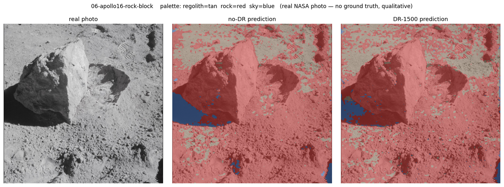
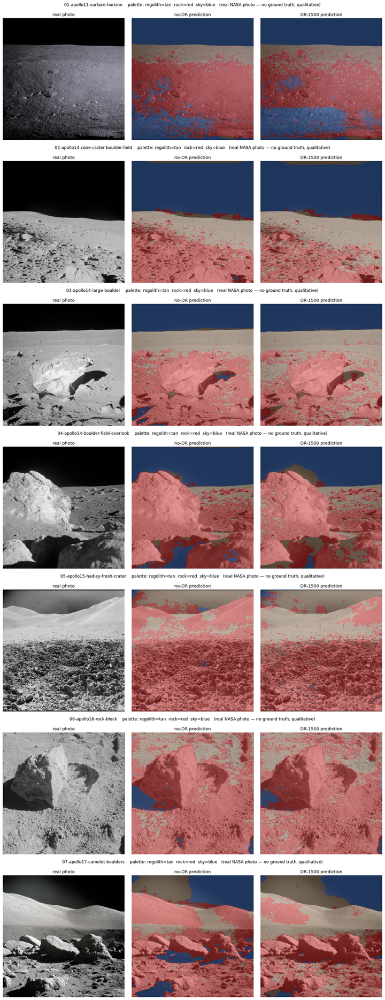

# 04 — Sim-to-real

*Chaotic Curiosity | regolith series*

---

Every number in this series so far has been measured on pixels a computer drew. Chapter 03 ended on a strong one: a SegFormer-B0 trained purely on domain-randomized synthetic renders scored **0.815 rock-IoU** on `test_photoreal` — a synthetic split built to sit *outside* the training distribution (brighter sun, higher albedo, rougher terrain, wider lenses). That is a real generalization result. But it is still a renderer grading its own homework.

This chapter spends the credibility. We point the deployed model — the same `dr_1500` checkpoint, weights frozen — at **real photographs of the Moon**, taken on real film by astronauts standing on the actual surface, and we look honestly at what it does. No retraining, no fine-tuning, no cherry-picking. The point is not to prove the model works on real lunar imagery. The point is to *measure the gap* between the synthetic world it learned and the real world it never saw — because that gap, named and shown, is the only honest version of "it works."

---

## What "sim-to-real" actually means here

A model trained on synthetic data learns whatever is *consistent* in that data. Some of what's consistent is real physics — a rock occludes the ground behind it, a sunlit slope is brighter than its shadow, the horizon cuts a hard line against black sky. That part transfers. But some of what's consistent is an *artifact of the renderer* — the exact statistics of the synthetic regolith texture, the particular way the path tracer makes a shadow falloff, the fact that the sky is always a mathematically pure black. The model has no way to tell physics from artifact. It fits both.

The **sim-to-real gap** is what you see when the artifacts stop holding. Real lunar film has grain, bloom, and exposure roll-off the renderer never produced. Real shadows are filled by bounce light and are never pure black. Real regolith has a fractal clutter of clods and micro-craters at every scale. When the model meets those, the physics-cues it learned keep paying off and the artifact-cues it learned start misfiring — and the misfires are the gap, made visible.

The rest of this chapter is those misfires, shown plainly, alongside the places the model genuinely succeeds.

---

## The synthetic ceiling, reproduced

First, a sanity check, and the script that formalizes it. `eval/eval_synth.py` loads a checkpoint and runs it over a labeled synthetic split, accumulating per-class confusion counts globally (the same way training did) so the number is directly comparable to chapter 03. Running the `dr_1500` checkpoint over all 300 frames of `test_photoreal`:

| Metric | Value |
|--------|------:|
| rock-IoU (global) | **0.8147** |
| mIoU (global) | 0.9139 |
| regolith IoU | 0.9521 |
| rock IoU | 0.8147 |
| sky IoU | 0.9750 |

That reproduces chapter 03's headline (0.815) to the third decimal from the saved weights — so the inference path used for the real images below (ImageNet normalization, SegFormer logits upsampled H/4 → 512² before argmax) is faithful. The committed numbers are in [`assets/eval-synth-dr1500.json`](assets/eval-synth-dr1500.json). **This 0.815 is the ceiling.** Everything that follows is below it.

---

## The real images

We curated **7 real, public-domain lunar surface photographs** from the NASA Image and Video Library, spanning five missions — **Apollo 11, 14, 15, 16, and 17** — and downloaded them over plain HTTPS. Every frame was chosen to *match the training viewpoint*: ground-level, rocky regolith, horizon, black sky, harsh single-source shadows. We deliberately avoided frames dominated by astronauts, the lander, the rover, flags, or Earth — the three-class model (`{regolith, rock, sky}`) was never trained on those objects, so scoring it on them would be a rigged test. The set is one **color** frame (Apollo 17) and six **black-and-white** frames, and includes both horizon-with-sky compositions and down-looking terrain-filling ones. Full citations, NASA IDs, and public-domain status are in [`eval/real_images/sources.md`](../../eval/real_images/sources.md).

Then the hard rule: **there is no ground truth for these images.** Nobody hand-labeled every pixel of AS11-40-5881 as regolith, rock, or sky. So we report **no IoU on the real images** — computing one would mean inventing a ground-truth mask and grading against our own guess, which is exactly the kind of number this series refuses to print. The real-image evaluation is **qualitative**: colored overlays you can inspect yourself, with the canonical palette (regolith = tan, **rock = red**, sky = blue). `eval/eval_real.py` letterboxes each photo to 512² (these frames are within ~1% of square, so the bars are negligible), runs both the `dr_1500` and `nodr_750` checkpoints, and lays them side by side: **real photo | no-DR prediction | DR-1500 prediction**.

> **The Kaggle cross-domain number, honestly skipped.** The plan allowed a bonus *quantitative* real-image score using the labeled "Artificial Lunar Landscape" dataset (Chang'e-3-derived masks) via `eval/data/download_real.py`. That dataset requires Kaggle credentials, and there were **none on the Spark** (no `~/.kaggle/kaggle.json`, no `KAGGLE_USERNAME`/`KAGGLE_KEY`, on host or in the container). Per the plan we did **not** attempt interactive auth — so there is no quantitative cross-domain IoU in this chapter. The fetch-and-map code (`download_real.py`, `class_mapping.py`) is in place for whenever a credentialed run happens.

---

## What transfers, and what breaks

Look at the overlays and the same two stories repeat on every frame.

**The horizon and the black sky transfer well.** On every frame with a clear sky above a bright horizon, the model finds the regolith/sky boundary cleanly. In the Apollo 11 surface frame the black upper sky is segmented as one coherent blue region with the horizon line tracked tightly; the same holds for the Apollo 14 boulder field and the Apollo 17 massif. This is the strongest transfer in the whole evaluation — and it makes sense, because "very dark region bounded by a hard bright edge" is genuine physics the renderer got right.


**Real rocks fire the hazard class.** The model genuinely detects large real rocks. The big bright boulder in the Apollo 14 frame is painted solidly red; so is the sampled block in the Apollo 16 close-up, the boulder cluster in the Apollo 17 foreground, and the dense cobble field of the Apollo 15 fresh crater. The capability the whole series was built to buy — "there is a rock here" — does fire on actual rocks.


But the gap is just as visible:

**Over-segmentation of rock on fine regolith.** Smooth real regolith gets flooded red. The Apollo 11 foreground is mostly fine soil with a few scattered clods, yet the model calls **42%** of it rock. Across the seven frames the DR model labels **~52% of pixels rock on average** (no-DR: ~61%) — wildly above the 1–8% rock fraction of a typical training frame, and above even the rockiest synthetic test frames (~30%). Some of that is fair: boulder fields and big blocks really are rock-dominated. But on the fine-regolith frames it is plainly false positives. Real regolith carries film grain, micro-shadows, and a brightness gradient the clean synthetic texture never had, and the model reads that clutter as rock.

**Dark shadows become sky.** The model learned, from synthetic data, that "nearly pure black" means sky — because in the renderer it always did. Real harsh shadows are *also* nearly black, so the model paints them blue. This is the most striking failure in the set: in the Apollo 16 block close-up the deep shadow on the block's left face and the shadow it casts are labeled **sky**, a blue lagoon sitting in the middle of the ground. The same shadow-as-sky error appears in the foregrounds of the Apollo 17 and Apollo 14 frames.



**Thin or hazed sky gets missed.** The flip side: when the sky is *not* a clean black band, the sky class under-fires. In the Apollo 15 Hadley frame the sky is a thin strip washed by a lens-flare halo; the model mostly fails to call it sky at all, labeling the top of the frame regolith and rock instead. The cue it relied on — pure black — wasn't there.


---

## Did domain randomization help on *real* images?

On synthetic data, DR's win was unambiguous and numeric: +0.099 rock-IoU, size-matched. On real images there is no ground truth, so there is **no honest numeric win to report** — and we will not manufacture one. What we *can* say, from inspecting all seven frames, is that DR changes the predictions in a consistent and plausible direction:

- **DR predicts less false rock.** On 6 of 7 frames the DR model labels fewer pixels rock than no-DR (rock fraction ~52% vs ~61% on average), pulling the over-segmented regolith back toward tan. On the seventh (the Apollo 16 block) they are effectively tied. Since much of that rock is false-positive on fine regolith, the pull-back is an improvement.
- **DR suppresses the shadow-as-sky hallucination.** This is the clearest, most repeatable difference. In the Apollo 17, Apollo 14 boulder, and Apollo 14 large-boulder frames, no-DR carves large blue "sky" blobs into foreground shadows; DR removes nearly all of them. This is the *same* failure DR cured on synthetic data — the no-DR model overfits one frozen appearance and reads dark-and-bright extremes wrong — now visibly cured on real pixels too.


So the honest verdict is **mixed, and it leans positive for DR**: domain randomization's *character* of improvement carries from synthetic to real — cleaner regolith, far fewer shadow-as-sky errors — even though both models still exhibit the core gap (over-segmented rock, mishandled shadows and hazed sky). DR is **better, not fixed**. A model you would actually fly needs real labeled lunar imagery in the loop — exactly the data this whole synthetic pipeline exists to reduce, not eliminate, the need for.

One more quietly encouraging note: six of the seven frames are **black-and-white**, a color regime the model never trained on, and it still produced coherent sky/horizon/rock structure on them. The geometry-and-tone cues transfer even when color is stripped away — more evidence that what DR taught was shape and shadow, not palette.



---

## Reproduce

On the Spark, inside the `regolith-train` container (NGC `pytorch:26.03-py3` with `transformers`). Checkpoints live at `outputs/runs/{dr_1500,nodr_750}/best.pt`; the real images travel with the repo in `eval/real_images/`.

```bash
# Synthetic ceiling — reproduce dr_1500's 0.815 on the held-out split
ssh spark "docker exec regolith-train bash -lc \
  'cd /workspace/regolith && python eval/eval_synth.py \
     --checkpoint /workspace/regolith/outputs/runs/dr_1500/best.pt \
     --test-split /workspace/datasets/test_photoreal \
     --out /workspace/regolith/outputs/eval_synth'"

# Real images — both checkpoints, side-by-side overlays
ssh spark "docker exec regolith-train bash -lc \
  'cd /workspace/regolith && python eval/eval_real.py \
     --checkpoint         /workspace/regolith/outputs/runs/dr_1500/best.pt \
     --compare-checkpoint /workspace/regolith/outputs/runs/nodr_750/best.pt \
     --image-dir /workspace/regolith/eval/real_images \
     --out /workspace/regolith/outputs/eval_real \
     --label DR-1500 --compare-label no-DR'"
```

`eval_real.py` writes one `real-<id>.png` panel per photo plus a `contactsheet.png`; the committed figures in `docs/reports/assets/` are the downsized copies. The predicted per-class fractions are in [`assets/real-predictions.json`](assets/real-predictions.json). (Optional, requires Kaggle creds: `eval/data/download_real.py` fetches the labeled Artificial Lunar Landscape set for a quantitative cross-domain IoU.)

---

## What you now understand

- The **sim-to-real gap** is the performance drop when a synthetically-trained model meets real images, and it has a concrete cause: the model can't separate the *physics* it learned (occlusion, shadow, horizon) from the *renderer artifacts* it learned (pure-black sky, clean texture statistics). The physics transfers; the artifacts misfire.
- The deployed model's synthetic ceiling is **0.815 rock-IoU** (reproduced from the saved weights via `eval_synth.py`). On **real** lunar photos there is **no ground truth**, so the evaluation is strictly qualitative — no fabricated IoU.
- **What transfers:** the horizon/black-sky boundary, and detection of large real rocks (the hazard class fires on actual boulders and blocks).
- **What breaks:** fine real regolith is over-segmented as rock (~52% of pixels called rock vs 1–8% in training), deep real shadows are mislabeled as sky, and thin or lens-flare-hazed sky is missed.
- **DR vs no-DR on real images:** no honest numeric claim is possible without labels, but DR consistently predicts less false rock and largely removes the shadow-as-sky hallucination that no-DR commits — the *same* improvement DR bought on synthetic data, now visible on real pixels. DR is **better, not fixed**.
- The gap is a legitimate, expected result — not a failure to hide. Closing it for real flight would require real labeled lunar imagery in the loop.

Continue to [05 — The render](05-the-render.md) *(coming next)*.
