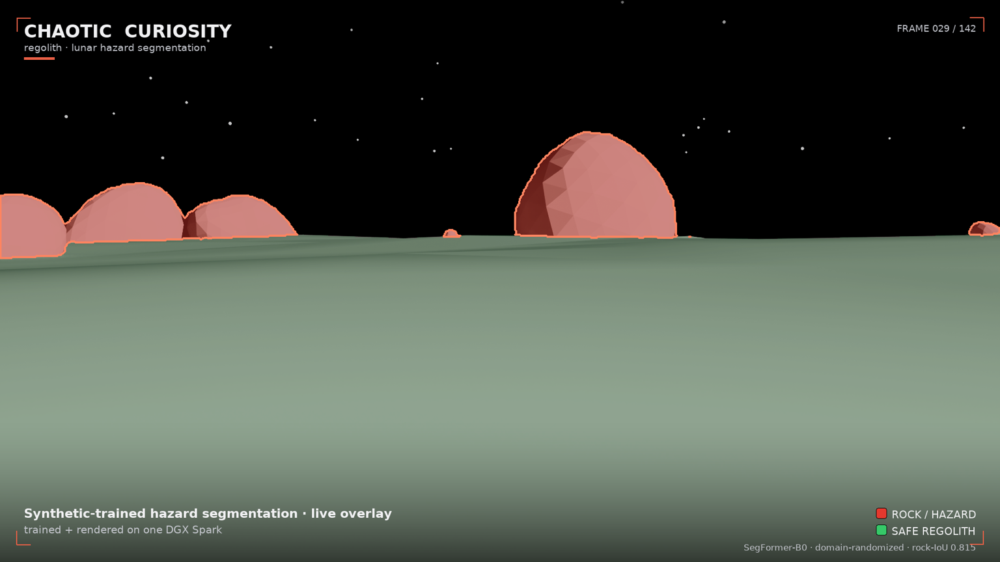
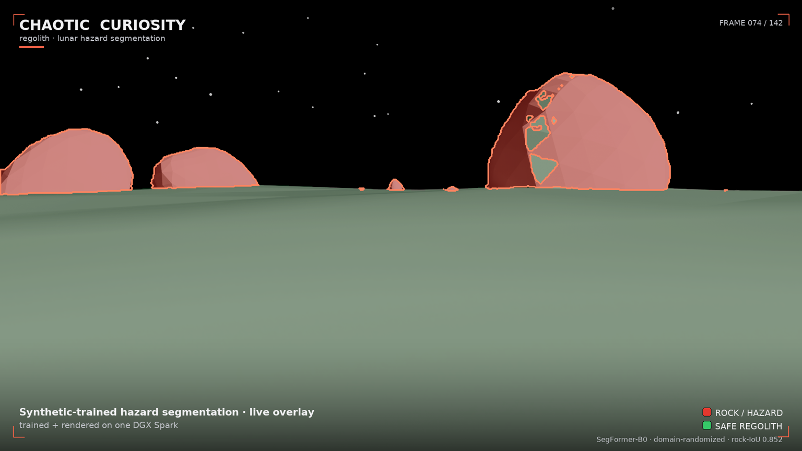
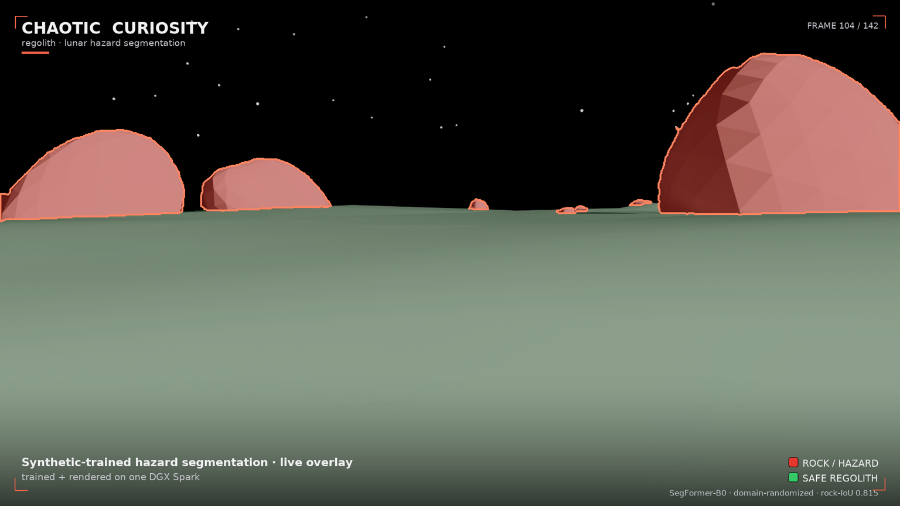
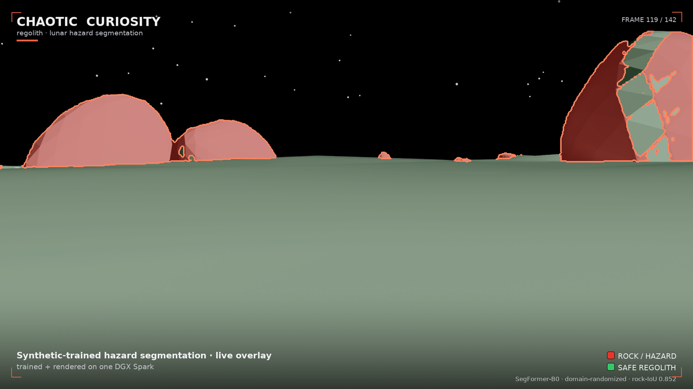

# 05 — The render

*Chaotic Curiosity | regolith series*

---

Five chapters in, you have a trained model with two very different numbers. On synthetic data `dr_1500` scores **0.852 rock-IoU** — the best in the project. On real Apollo photographs (chapter 04) the same weights flood ~83% of the frame with false rock. The sim-to-real gap is named and measured, and it is wide. What you have not done yet is *show the model working* — in motion, on the kind of scene it was actually trained for.

That is this chapter, and it comes with a warning attached. You will use NVIDIA Omniverse's **RTX renderer** to fly a rover camera slowly into a boulder field — a low-sun scene with long raking shadows — and composite the trained hazard model's predictions onto every frame in real time. Boulders glow red with a bright detection outline. Safe traversable ground goes green. Sky is untouched. The result is a rover's-eye **hazard HUD** rendered cinematically at 1920 × 1080 and assembled into a flythrough — and it looks *clean*. That cleanliness is exactly the thing chapter 04 warned you not to trust: this scene is **in-distribution**, so the overlay flatters the model the same way the 0.852 synthetic score does. The render is the loop closing — synthetic data → trained model → per-frame inference → cinematic render, all on one 128 GB DGX Spark — and a live demonstration of *why a beautiful synthetic result is not evidence of real-world readiness.*

---

## Why in-distribution — and why that is the honest choice

The scene was built to be **in-distribution**: every visual parameter — sun elevation, regolith albedo, rock count, camera height, field of view — falls inside the ranges `train_dr.yaml` used to generate the training set. The model has not literally seen this camera path or this rock layout, but it has seen *this kind of scene*.

That is a deliberate framing decision. When you want to demonstrate what a model *can* do at its best, you put it in the regime it was trained for. If you ran the overlay over the `test_photoreal` conditions (brighter sun, higher albedo, wider lenses) you would see more misfires — not because the model is broken, but because you moved it into known-harder territory. Chapter 04 already showed what out-of-distribution looks like. This chapter shows the in-distribution ceiling.

One cosmetic adjustment is applied: a `--display-gain 0.78` is multiplied into the *composite output only*, to bring the brighter RTX render (auto-exposed to mean ~108) down toward the visual range of the training frames (mean ~82), so the overlay looks grounded rather than washed-out. **The model runs inference on the original, unmodified pixels.** The gain touches only what you see; it does not touch what the model sees. The predictions are real.

---

## The scene: `build_lunar_stage(seed=7, HERO_PARAMS)`

The hero scene is procedurally generated with a fixed seed (7) and a hand-picked but in-distribution parameter set:

| Parameter | Value | Why |
|-----------|-------|-----|
| Sun elevation | 11° | Grazing — long raking shadows across the boulder field |
| Sun azimuth | 122° | Side-back; dome hole stays ~120° off-axis, safely outside the frustum |
| Sun intensity | 17 000 | High end of training range — high contrast |
| Regolith albedo | 0.19 | Mid-range, visually mid-gray |
| Terrain amplitude | 3.7 m | Slightly rugged |
| Rock count | ~95–125 far-field + 14 near boulders | Dense boulder field in the foreground |
| Camera height | 2.0 m | Nominal rover eye height |
| Camera FOV | 62° | Nominal lens |

The camera follows a **252-pose flythrough path** — a slow dolly forward (y: −95 → −63 m, closing ~32 m on the boulder field), a gentle lateral arc (±7 m), a slow yaw pan (+6° → −6°), an easing tilt (−1.5° → −3°), and a subtle vertical bob. The overall effect is a gradual approach toward the boulders, rocks growing in frame as the camera closes in. The model's predicted rock fraction climbs from ~5% in the opening frames to ~9% in the final frames — an honest signal of the model registering more hazard as rocks fill the image.

---

## RTX rendering: RayTracedLighting, 48 subframes, 1920 × 1080

The render uses **`RayTracedLighting`** — Omniverse's full RTX path-tracing mode with global illumination, area shadows, and DLSS temporal accumulation. Key settings:

| Setting | Value |
|---------|-------|
| Resolution | 1920 × 1080 (full HD) |
| Mode | `RayTracedLighting` |
| RTX subframes | 48 (more accumulation passes per image, less path-tracing noise) |
| Wall-clock speed | ~2.4 s/frame warm |
| Total render time | ~10.4 min for 252 poses |

The pipeline has three stages, each self-contained:

- **Stage A (render):** Build the hero scene once, walk the 252-pose camera path inside a fresh Isaac Sim container, capture each frame from the `LdrColor` annotator, skip-save until lit. Outputs: raw PNG frames in `regolith_render/rgb/`.
- **Stage B (overlay):** Load each RGB frame in a PyTorch container, run `dr_1500/best.pt` inference on each, composite the hazard visualization, add branding. Outputs: composited PNGs in `regolith_render/overlay/`.
- **Stage C (assemble):** Call host `ffmpeg` to produce the full-res MP4, web preview MP4, hero stills, and the GIF. Host-side; no GPU needed.

---

## The hard part: why BasicWriter wrote black frames

Here is the gotcha that consumed most of this session's debugging time. It is worth understanding because it is a genuine trap in Omniverse RTX on this hardware.

**`BasicWriter` — the standard Replicator output writer used in chapters 01 and 02 — writes all-black RGB frames.** Not dark, not underexposed — exactly zero in every channel. The semantic segmentation masks rendered perfectly; only RGB was black. The first instinct ("is the scene set up wrong?") is incorrect.

The root cause: `BasicWriter` captures at **step time**, synchronously, before NVIDIA's **DLSS temporal accumulation** and **auto-exposure** pipeline have converged. The `LdrColor` buffer — the finished, post-processed color output — is still zero at capture time because the renderer has not had enough frames to complete its temporal integration. The semantic label buffer takes an entirely different, non-temporal path through the renderer, which is why semantics worked while RGB did not.

Confirmed via annotator probe: a `BasicWriter` frame read mean **0** at the same timestep that the `LdrColor` annotator read mean **~64** (fully lit).

**The fix has two parts:**

**1. Read from the `LdrColor` annotator directly.** Attach `rep.annotators.get("LdrColor")` to the render product, call `.get_data()` after each step, save the PNG yourself. This reads the output of the completed color pipeline — post-DLSS, post-exposure — rather than the raw step-time capture.

**2. Drive convergence with real camera motion.** A static camera, or a camera executing only tiny positional jitter, does not warm the temporal pipeline — verified experimentally. DLSS accumulation needs sustained translation and rotation. The render uses a single continuous capture pass with **skip-save until mean pixel value > 50**, numbering saved frames contiguously from the first lit one. No separate warmup loop; warmup happens as part of the hero approach path.

The warmup consumed approximately 108 of the 252 hero poses — the opening segment where the boulders are at their greatest distance. The 144 saved lit frames are the stable approach segment. Two more were dropped as edge cases (`--skip-head 2`), leaving **142 final frames**. At 24 fps: **5.9 seconds** of clean footage.

---

## The hazard overlay

The overlay runs the same `dr_1500/best.pt` checkpoint from chapter 03 on each of the 142 lit frames. The inference path is identical to chapters 03 and 04:

- Input: rendered 1920 × 1080 PNG → downscaled to 1024 × 576 (16:9 aspect preserved), **ImageNet-normalized**
- SegFormer-B0 forward pass → logits at H/4 resolution → nearest-neighbor upsample to 1024 × 576 before argmax
- Predicted mask upsampled back to 1920 × 1080 (nearest-neighbor, preserving hard boundaries)
- Composite palette:
  - **rock** — semi-transparent red tint + bright red outline drawn on the *eroded inner edge* of each detection, so the outline stays inside the predicted region rather than bleeding outward
  - **regolith** — light green tint (lower opacity than rock — traversable ground stays visible through the highlight)
  - **sky** — untouched
- Branding overlay: Chaotic Curiosity wordmark, scene caption, color legend, corner tick marks

The mean predicted rock fraction across all 142 frames is **~6.9%**, consistent with a scene at the denser end of the in-distribution rock-fraction range (~1–8% in training). The fraction climbs from ~5% in the opening (boulders distant) to ~9% in the final frames (boulders close-in). The model is correctly tracking hazard proximity.










---

## Why the overlay is clean — and the honest asterisk

The overlay looks coherent: tight outlines, green regolith floor, no stray rock bleeding into the sky. Three reasons, stated plainly:

**In-distribution scene.** The model trained on scenes that look exactly like this one — the same renderer, the same regolith heightfield, the same basalt boulders. The catastrophic failure from chapter 04 — flooding ~83% of a real frame with false rock, plus the rock-cloud in the sky — does not appear, because here the regolith is the *synthetic* regolith the model learned to tell apart from rock. On real film the soil carries the rough gray bumpy texture the model reads as rock; the renderer's smooth heightfield does not. So the boundary that collapsed on real pixels holds perfectly here. This is the single most important caveat in the chapter: **the overlay is clean because the ground is fake.** The clean 0.852 synthetic score and this clean render are the *same* flattery, produced by the *same* in-distribution comfort — and chapter 04 is what happens when you remove it.

**Inference on unmodified pixels.** The `--display-gain` adjustment was applied after the fact, to the composite. The model's input was the raw RTX `LdrColor` output — the same brightness regime as training frames, un-adjusted.

**Boulder-field design.** Fourteen near-field boulders close enough to produce solid large-area rock detections, against a clearly textured regolith floor and near-black sky. The scene was chosen to be *legible*, not to be the hardest possible case.

The clean overlay is a demonstration of the capability this series set out to build — a model that correctly identifies rocks when shown the kind of scene it trained on, shown cinematically. It is **not** a proof of real-world readiness, and after chapter 04 you should distrust it precisely *because* it is so clean. Chapter 04 is the reality check, and it showed not a gap but a flood. Both results are part of the honest record — and the gap between this beautiful render and that flooded Apollo frame is the whole point.

---

## Reproduce

```bash
# Stage A — render RGB frames (Isaac Sim container)
# IMPORTANT: do NOT force-kill the container mid shader-compile.
# A stale .cache/ov/_cache.lock will cause the next container to hang at boot
# (SimulationApp never starts; GPU stays at 0%). Fix: rm the lock file and relaunch.
ssh spark "docker run -d --name isaac-render --entrypoint bash --gpus all --network=host \
  -e ACCEPT_EULA=Y -e PRIVACY_CONSENT=Y \
  -v /home/chaotic-curiosity/regolith:/workspace/regolith:rw \
  -v /home/chaotic-curiosity/regolith_render:/workspace/render_out:rw \
  -v /home/chaotic-curiosity/regolith_cache:/isaac-sim/.cache:rw \
  nvcr.io/nvidia/isaac-sim:6.0.0 -lc 'sleep infinity'"
ssh spark "docker exec isaac-render bash -lc 'cd /workspace/regolith && /isaac-sim/python.sh \
  render/render_predictions.py render --out /workspace/render_out --seed 7 --frames 252 \
  --width 1920 --height 1080 --renderer RayTracedLighting --subframes 48 \
  --prime-steps 8 --lit-threshold 50'"
ssh spark "docker rm -f isaac-render"

# Stage B — overlay predictions + branding (PyTorch container with transformers)
ssh spark "docker exec regolith-overlay bash -lc 'cd /workspace/regolith && python \
  render/render_predictions.py overlay --checkpoint outputs/runs_v2/dr_1500/best.pt \
  --rgb-dir /workspace/render_out/rgb --out /workspace/render_out/overlay \
  --display-gain 0.78 --skip-head 2'"

# Stage C — assemble MP4 + stills + preview (host ffmpeg — no GPU needed)
ssh spark "python3 /home/chaotic-curiosity/regolith/render/render_predictions.py assemble \
  --overlay-dir /home/chaotic-curiosity/regolith_render/overlay \
  --out /home/chaotic-curiosity/regolith_render --fps 24"
```

Outputs on the Spark:
- `regolith_render/regolith_flythrough.mp4` — 1.23 MB, 1920 × 1080 H.264 faststart (git-excluded; published as a GitHub Release asset)
- `regolith_render/rgb/` — raw RTX frames
- `regolith_render/overlay/` — composited frames
- `regolith_render/stills/` — hero stills

Committed to `docs/reports/assets/`: `render-hero-{1..4}.png`, `render-preview.mp4` (1280-wide, 0.18 MB), `render-preview.gif` (720-wide, 2.64 MB).

---

## What you now understand

- **RTX rendering** in Omniverse uses `RayTracedLighting` with `rt_subframes` accumulation for path-traced output; 48 subframes at 1920 × 1080 runs at ~2.4 s/frame on a DGX Spark.
- **`BasicWriter` writes black frames** on this hardware because it reads the `LdrColor` buffer before DLSS temporal accumulation and auto-exposure converge. Fix: attach an `LdrColor` annotator directly, drive convergence with sustained real camera motion, and skip-save frames below a brightness threshold.
- **`--display-gain` touches the composite only.** The model sees the original pixels; the gain is cosmetic output adjustment. When you read "predictions are real," this is what that means.
- **In-distribution vs out-of-distribution** determines overlay quality more than model quality. The render demonstrates the flattering in-distribution ceiling (0.852); chapter 04 removed the comfort and measured the flood (~83% false rock on real soil). A clean synthetic overlay is not evidence of real-world readiness — it is the same in-distribution flattery the synthetic benchmark gives.
- The three-stage pipeline (render → overlay → assemble) keeps Isaac Sim, PyTorch, and ffmpeg in separate containers and host processes, avoiding dependency conflicts on the DGX.
- Never force-kill an Isaac container mid shader-compile — it leaves a stale `_cache.lock` that hangs the next container at boot.

---

The render is the loop closed: scene → dataset → trained model → cinematic inference, end to end on one machine. But it is also the most flattering view of the model in the entire series — the in-distribution best case, shown cinematically. Chapter 04 was the worst case, on real pixels. The two together raise the question the final chapter answers: we made the rocks realistic to *improve* this, and it made the real-world result worse — so what actually happened, and what is the lesson? Chapter 06 tells that story start to finish, with the before-and-after geometry side by side.

Continue to [06 — Rock fidelity: an evolution](06-rock-fidelity.md).
