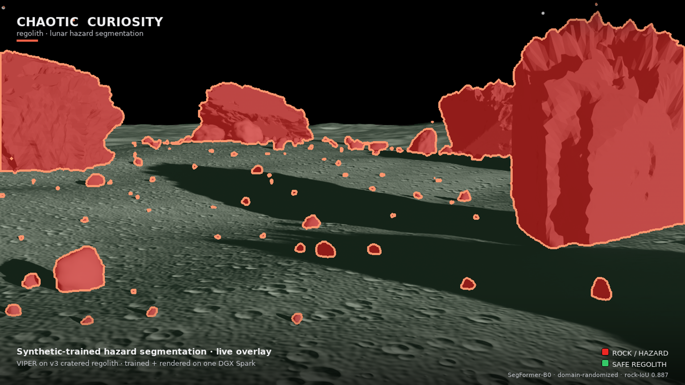

# 07 — Realistic ground: the sim-to-real lever

*Chaotic Curiosity | regolith series*

---

Chapter 06 ended on a failure stated without flinching: we made the synthetic rocks photoreal, the synthetic benchmark rose to 0.852 rock-IoU, and the real-world transfer got **worse** — the model flooded ~83% of every real Apollo frame with false rock, up from ~52% on the crude first build. The diagnosis was specific: photoreal rocks (rough, gray, bumpy, matte) collapsed the rock-vs-regolith boundary toward "any rough gray texture is rock," and real lunar regolith is exactly that at photographic resolution.

That diagnosis is not just an autopsy. Read it again and it hands you a hypothesis. The shortcut existed only because, in our simulator, *the rocks were the rough thing and the ground was not* — a smooth displaced heightfield against pitted basalt boulders. The model latched onto the one texture difference the renderer gave it. So the fidelity was in the wrong place. **If "rough gray = rock" is the bug, the fix is to make the ground rough and gray too** — to put the realism on the regolith, where the sim-to-real gap actually lives, instead of only on the rocks. This chapter is that experiment, v3, and — for the first time in the series — the obvious-sounding fix *worked*. Synthetic rock-IoU climbed again, to **0.887**, and the real-photo flood **dropped to 35.7%**, well below both prior builds.

---

## The hypothesis the failure handed us

Hold the two builds side by side at the level of *what the renderer made distinct*:

- **v1 (crude rocks):** smooth low-poly blobs on a smooth heightfield. The rocks were visually unlike any plausible soil, so the model learned a **shape** boundary — "blobby object vs. flat ground." Crude geometry was accidentally protecting us; it kept the classes far apart, and the real flood stayed near 52%.
- **v2 (photoreal rocks):** pitted basalt boulders on the *same* smooth heightfield. Now the only salient cue separating the two classes was **texture** — and the model took it. "Rough gray bumpy = rock" scored beautifully in a world where only rocks were rough, and catastrophically on real film where the soil is rough too. The flood jumped to 83%.

The pattern across both: the model fits whatever the renderer makes *consistently different* between rock and regolith. In v2 that difference was a texture artifact — rocks textured, ground smooth — and texture is precisely the cue that fails to transfer, because real regolith shares it. The lesson of chapter 06 was "naive realism can backfire." The hypothesis hiding inside it is sharper: **realism backfires when you apply it to the foreground object and leave the background unrealistic, because the contrast between them becomes the shortcut.** Make the background just as realistic and the shortcut disappears — the model is forced to find a cue that survives contact with the real world.

So v3 changes the variable v2 left fixed. It does not make the rocks *less* realistic. It makes the **ground** realistic enough to match them.

---

## What changed in the scene

The scene machinery from chapters 01–02 carries over unchanged — same OpenUSD stage, same `BasicWriter` label masks, same canonical `{regolith: 0, rock: 1, sky: 2}` map, same DGX Spark. Three things changed, and they all move fidelity onto the surface and its lighting.

### A realistic cratered, dark, displaced regolith ground

This is the lever. The v1/v2 ground was a fBm heightfield with a handful of craters, shaded a warm mid-gray at albedo ~0.18 — relief enough to read in a render, but smooth and *bright* up close. The v3 ground is rebuilt to look like the thing an Apollo Hasselblad actually photographed:

- **Dark.** Base albedo dropped to **~0.08–0.12** — the real reflectance of lunar mare regolith, far darker than the old 0.18. A dark ground is the first thing that distinguishes a genuine lunar frame from a studio render, and it stops the model from keying on "bright = ground, dark = rock," which the old albedo gap quietly encouraged.
- **Cratered and displaced.** The surface carries dense small-crater pitting and fine displacement on top of the broad fBm — clods, micro-craters, and grain at the scale the camera sees from rover height. The ground is no longer smooth between the rocks; it has the same rough, matte, high-frequency character the photoreal rocks have.
- **Normal-mapped.** A surface **normal map** adds per-pixel relief — the fine bumpiness of real soil — without exploding the polygon count. This is what gives the regolith its rough texture *at photographic resolution*, which is exactly the resolution at which v2's shortcut lived.

The effect is deliberate and a little counter-intuitive: we made the *ground* harder to tell apart from the rocks, on purpose. In v2 the renderer handed the model an easy texture cue. In v3 we take it away. Now a rough gray bumpy patch could be ground *or* rock, so "rough gray = rock" no longer separates the classes inside the simulator — and the model has to learn something that does.

### Power-law rock sizes

The rocks stay the photoreal noise-displaced basalt of chapter 01, but their **size distribution** is rebuilt to follow a **power law** — many pebbles, fewer cobbles, rarer boulders, a continuous spread from a few centimeters to several meters. Real rock-size–frequency on the Moon is power-law; a scene drawn from one looks right and, more importantly, teaches the model **scale** as a cue. A power-law field means the model constantly sees rock at every size against the same ground, so it cannot use absolute size as a proxy — it has to learn the relationship between a rock and the surface it sits on.

### Harsh real lunar lighting

The sun stays a `UsdLux.DistantLight` with crisp, atmosphere-free shadow edges, pushed toward the harsh low-angle illumination of real lunar surface operations — long raking shadows that read the discrete, shadow-casting geometry of a rock against the continuous, self-shadowing texture of the ground. Shadow is the one cue that genuinely separates a rock from soil in a real photograph, and harsh lighting makes it loud.

### VIPER

For the render, the hero rover is a model of **VIPER** (Volatiles Investigating Polar Exploration Rover) — NASA's lunar south-pole rover, gold chassis, blue solar panels, mast camera. The render is VIPER's **forward hazard-cam**, with the live segmentation overlay — a rover's-eye hazard HUD threading the boulder field from the driver's seat. It is the same rover-eye perception task the whole series is about, now with a body attached to the camera (seen in the path-traced beauty plate below).


---

## The results

Same SegFormer-B0 recipe as v1 and v2 (`nvidia/mit-b0`, class-weighted CE, AdamW lr 6e-5, batch 8, seed 0, early-stop patience 8, best checkpoint on `test_photoreal` rock-IoU), same three-run size-matched ablation. Only the dataset changed — regenerated on the v3 scene. Every number below ties to a committed artifact: [`outputs/runs_v3/RESULTS.md`](../../outputs/runs_v3/RESULTS.md) and `results.json`, the per-run overlays, and the render in `assets/`.

### The three v3 runs

| Run | Frames | DR? | synth rock-IoU | real flood | best epoch |
|-----|-------:|:---:|:--------------:|:----------:|:----------:|
| `nodr_750` | 750 | no | 0.8593 | 39.7% | 14 |
| `dr_750` | 750 | **yes** | 0.8675 | 36.3% | 16 |
| `dr_1500` | 1,500 | yes | **0.8870** | **35.7%** | 31 |

Synthetic rock-IoU is the global accumulated tp/fp/fn over all 300 `test_photoreal` frames (the same way training measured it). **Real flood** is the mean fraction of pixels a model predicts `rock` across **21** NASA public-domain Apollo and Surveyor surface photographs (`eval/real_images_v3`, no ground truth) — lower is better, because real lunar terrain is mostly safe regolith. Both columns move the right way as you add domain randomization and data, and they move the right way *together* — which did not happen in v2.

### The cross-version headline

| Version | rocks | ground | synth rock-IoU (`dr_1500`) | real flood (`dr_1500`, same 21 images) |
|---------|-------|--------|:--------------------------:|:----------------------:|
| v1 | low-poly blobs | smooth heightfield | 0.815 | 44.0% |
| v2 | photoreal basalt | smooth heightfield | 0.852 | 72.6% |
| **v3** | power-law basalt | **cratered dark displaced** | **0.887** | **35.7%** |

This is the whole arc in four numbers. v1→v2 moved the synthetic score up and the real flood the wrong way — the failure. v2→v3 moves the synthetic score up *again* **and** drops the real flood below even v1's crude baseline. For the first time the two arrows point the same direction. The change between v2 and v3 is a single design decision: **the fidelity moved from the rocks to the ground.**

> **The comparison is exact, not directional.** Every flood number in the table above is measured the same way: all three `dr_1500` checkpoints are run through the **same hardened `eval/eval_real.py`** on the **same 21** NASA Apollo/Surveyor photographs (`eval/real_images_v3`, 0 skipped) — `model.py` is identical across versions, so the v1 and v2 checkpoints load and run cleanly under the current eval. It is a controlled same-set delta: v2 floods **72.6%** of the real pixels, v1 **44.0%**, and v3 just **35.7%**, below even v1's crude baseline. For provenance, v1 and v2 were *originally* scored on an older 7-image set, where they flooded ~52% and ~83% (the numbers chapters 04 and 06 report); re-running those exact checkpoints on the larger, harder 21-image set with the current eval gives the 44.0% / 72.6% here. The ordering is unchanged and the gap is enormous; the mechanism below is what makes the drop credible.

### Where the synthetic gain comes from

Decomposing the v3 synthetic ablation the same honest way chapter 03 did — size-matched first, then scale:

- **Domain randomization, size-matched** (`dr_750` vs `nodr_750`, both 750 frames): 0.8593 → 0.8675 = **+0.008** rock-IoU. Pure DR, data held fixed.
- **More data** (`dr_1500` vs `dr_750`, DR held fixed): 0.8675 → 0.8870 = **+0.019**. Scale adds the rest.
- **Combined over the no-DR baseline** (`dr_1500` vs `nodr_750`): **+0.028**.

The size-matched DR slice keeps shrinking across the series — +0.099 (v1) → +0.046 (v2) → **+0.008** (v3) — and the reason is the same one chapter 03 named: each fidelity upgrade raises the no-DR floor, leaving DR less brittleness to fix. The v3 no-DR baseline (0.8593) is already higher than v2's *best deployed* model (0.8521). The realistic ground does so much of the generalization work on its own that domain randomization's marginal contribution is now small; the remaining headroom comes mostly from scale.

---

## Why the flood dropped

The mechanism is the mirror image of chapter 04's, and it is worth stating plainly.

In v2, the model's most generalizable cue was **texture**: "rough gray bumpy = rock." It worked in the simulator because only the rocks were rough; it failed on real film because real regolith is rough too. The boundary collapsed and the soil flooded across it.

In v3, **the ground is rough too.** Inside the training simulator, a rough gray bumpy patch is now just as likely to be regolith as rock. The texture cue no longer separates the classes — so the model cannot learn it, because it would score terribly on its own training data. What *does* separate a rock from the ground, in a world where both are rough and dark, is **shape, cast shadow, and scale**: a rock is a discrete, convex, shadow-casting object embedded in a continuous, self-shadowing surface. Those are the cues v3 forces the model to use, and — unlike texture — they are **real**. They hold on an Apollo photograph because real rocks genuinely are discrete shadow-casting objects on continuous soil.

So the flood drops not because the model got bigger or trained longer, but because we **removed the shortcut**. By making the ground realistic, we made the lazy cue useless and the honest cue necessary. The model learned the honest cue and it transferred.

You can see it in the overlay. On the v3 forward hazard-cam, the dark cratered regolith floor — rough, pitted, exactly the texture that drowned v2 in red — is left almost entirely **un-flooded** (the faint green safe-regolith tint), while the discrete boulders, from foreground masses down to scattered pebbles, are picked out cleanly in red with tight detection outlines. The model is segmenting *objects against a surface*, not *texture against smoothness*.




---

## Domain randomization helps again

There is a quieter result in the v3 table that matters as much as the headline. In v2, domain randomization made the real flood **worse** — `dr_1500` predicted more false rock than the no-DR control on all seven real frames, because DR amplifies whatever the model treats as invariant, and v2's invariant was the bug. In v3, that flips back:

| Run | real flood |
|-----|:----------:|
| `nodr_750` | 39.7% |
| `dr_750` | 36.3% |
| `dr_1500` | **35.7%** |

Domain randomization now **reduces** the flood (39.7% → 35.7%), in the same direction it improves the synthetic score. This is the tell that the underlying cue is finally a good one. DR still amplifies whatever the model decides is invariant — but in v3 the invariant it found is shape-and-shadow, not texture, so amplifying it helps on real pixels instead of hurting. The lever that backfired in v2 works again in v3, for the same reason everything else does: the ground fix gave the model an invariant worth amplifying.

---

## The honest outlier

The flood is not uniform across the 21 real frames, and one stays stubbornly high. The **Apollo 11 Tranquility Base wide panorama** floods at **71.2%** — far above the next-worst frame (~56%) and more than double the best frames (Surveyor 1 at 15%, the Apollo 11 footprint close-up at 17%). It is a genuine outlier, and it is worth understanding rather than hiding.

That frame is a low-contrast, distant-horizon panorama: a wide, flat, evenly-lit expanse with the boundary between near soil and far soil washed out, few discrete shadow-casting rocks, and a hazy bright horizon. It is the one composition where v3's honest cues have the least to grab — no strong cast shadows, no clear discrete objects, no scale anchor — so the model falls back toward over-predicting rock. It is the same kind of frame that gave v2 its worst trouble, and v3 improves it but does not solve it. The other 20 frames carry the win; this one marks the edge of it. A model you would actually fly would still need real labeled imagery of exactly these low-contrast wide-panorama conditions in the loop — the honest caveat the whole series keeps returning to.

---

## A sidebar: the descriptor leak

Generating the v3 dataset was not clean, and the failure is good engineering color. Partway through the large `train_dr` generation, the RTX renderer started throwing **"out of descriptors"** — a slow resource leak in the long-lived Isaac Sim process that accumulates GPU descriptor handles across thousands of frames until allocation fails mid-run. On the Spark's unified-memory architecture this is exactly the kind of thing that can spiral rather than fail cleanly.

The fix was not to chase the leak inside the process but to design around it: a **chunked, fresh-container generator** that renders the dataset in bounded batches, tearing down and relaunching a clean Isaac Sim container between chunks so the descriptor pool is reset every time, and **resuming from the last completed frame** so no work is lost. The generator checks what is already on disk, picks up where the previous chunk stopped, and continues. The full 1,500 + 750 + 300 dataset came out with zero data loss and zero corrupted frames — the leak became a non-event the moment generation stopped depending on a single process surviving the whole run.

---

## The render: the loop, closed

The v3 render is the cinematic payoff and the live proof that the pipeline runs end to end. It is a **1920 × 1080 flythrough** of VIPER crossing the v3 cratered-regolith boulder field, with two things composited on every frame: the **forward hazard-cam** carrying the live `dr_1500` segmentation overlay (rock = red + outline, safe regolith = faint green, sky untouched), and the Chaotic Curiosity branding and legend. The overlay is genuine live inference on each rendered frame — the same checkpoint, the same path the synthetic and real evaluations used.


The full-quality 1080p version is [`render-v3-preview.mp4`](assets/render-v3-preview.mp4); the GIF above is the inline preview. Four path-traced hero stills — [hero-1](assets/render-v3-hero-1.png) (opening), [hero-2](assets/render-v3-hero-2.png) (the closest-approach money shot), [hero-3](assets/render-v3-hero-3.png), [hero-4](assets/render-v3-hero-4.png) — plus two raw path-traced VIPER beauty plates ([beauty](assets/render-v3-beauty.png), [beauty2](assets/render-v3-beauty2.png)) and a path-traced forward plate with the overlay ([overlay-pt](assets/render-v3-overlay-pt.png)) are all committed in `assets/`.

A fair caveat, kept from chapter 05: the render scene is still **in-distribution** — it is the v3 synthetic ground the model trained on, so the clean overlay is still the flattering view, not a proof of real-world readiness. What changed is that the model *behind* the flattering view now also holds up far better on real Apollo and Surveyor photographs (35.7% flood, down from v2's 72.6% on the same 21 photographs). In v2, the clean render hid a model that flooded real soil. In v3, the clean render is backed by a real-photo number that finally moved the right way. The render is the cinematic; the 35.7% is the proof.

And that closes the loop this series set out to close, now with a genuine win at the end of it: **synthetic data → trained model → live inference → cinematic render**, authored, generated, trained, evaluated, and rendered on a single 128 GB NVIDIA DGX Spark. The scene was built in OpenUSD, the dataset generated by Omniverse Replicator, the model fine-tuned in PyTorch, the transfer measured on real lunar photographs, and the flythrough path-traced by the RTX renderer — one machine, the whole pipeline, three times over (v1, v2, v3), with each version's honest result feeding the next version's design. v2 failed; the failure was the experiment that told us where to put the fidelity; v3 put it on the ground and it worked.

---

## Reproduce

The v3 retrain + eval pipeline runs inside the `regolith-train-v3` container (NGC `pytorch:26.03-py3` with `transformers`), pointed at `datasets_v3` (regenerated on the v3 scene) → `outputs/runs_v3` + `outputs/eval_v3`. Hyperparameters are identical to v1/v2; only the dataset changed.

```bash
# Full v3 pipeline: 3-run ablation -> synth eval -> real eval (21 photos) -> aggregate
ssh spark "docker exec -d regolith-train-v3 bash -lc \
  'cd /workspace/regolith && bash run_pipeline_v3.sh'"

# Watch progress
ssh spark "docker exec regolith-train-v3 bash -lc \
  'tail -f /workspace/regolith/outputs/runs_v3/dr_1500.log'"
```

Equivalently, the three training runs explicitly (the size-matched DR split `train_dr_750` is the first 750 frames of `train_dr`, symlinked, exactly as in chapter 03):

```bash
DATA=/workspace/datasets_v3
COMMON="--val-split $DATA/test_photoreal --epochs 40 --patience 8 \
        --model segformer_b0 --lr 6e-5 --batch 8 --seed 0"
ssh spark "docker exec regolith-train-v3 bash -lc \
  'cd /workspace/regolith
   python training/train.py --train-split $DATA/train_nodr   $COMMON --out outputs/runs_v3/nodr_750
   python training/train.py --train-split $DATA/train_dr_750 $COMMON --out outputs/runs_v3/dr_750
   python training/train.py --train-split $DATA/train_dr     $COMMON --out outputs/runs_v3/dr_1500'"

# Synthetic ceiling + real flood for the deployed checkpoint
ssh spark "docker exec regolith-train-v3 bash -lc \
  'cd /workspace/regolith
   python eval/eval_synth.py --checkpoint outputs/runs_v3/dr_1500/best.pt \
     --test-split $DATA/test_photoreal --out outputs/eval_v3/eval_synth/dr_1500
   python eval/eval_real.py  --checkpoint outputs/runs_v3/dr_1500/best.pt \
     --image-dir eval/real_images_v3 --label dr_1500 --out outputs/eval_v3/eval_real/dr_1500'"
```

The render reuses the three-stage pipeline of chapter 05 (render → overlay → assemble), pointed at the v3 checkpoint `outputs/runs_v3/dr_1500/best.pt` and the v3 scene (with the VIPER rover authored onto the cratered surface), and the live `dr_1500` overlay composited on the forward hazard-cam. The aggregated numbers land in [`outputs/runs_v3/RESULTS.md`](../../outputs/runs_v3/RESULTS.md) (`make_results_v3.py`). Datasets, checkpoints, and the full-res MP4 stay on the Spark — heavy binaries, excluded from git. The committed artifacts are the results files, the figures, and the render assets in `docs/reports/assets/`.

---

## What you now understand

- **The v2 failure was a hypothesis in disguise.** "Rough gray = rock" was a shortcut that existed only because the rocks were rough and the ground was smooth. The fidelity was in the wrong place: on the foreground object, not the background surface.
- **v3 moved fidelity onto the ground** — a dark (albedo ~0.08–0.12), cratered, displaced, normal-mapped regolith surface, power-law rock sizes, and harsh low-angle lighting — so the synthetic ground now shares the rough matte texture real regolith has.
- **Removing the shortcut forced an honest cue.** With both rock and ground rough inside the simulator, "rough gray = rock" no longer separates the classes, so the model had to learn **shape, cast shadow, and scale** — cues that are real and transfer to Apollo photographs.
- **It worked, on both axes.** Synthetic rock-IoU rose to **0.887** (`dr_1500`) and the real-photo flood **dropped to 35.7%**, versus v2's 0.852 / 72.6% and v1's 0.815 / 44.0% — all three floods measured the same way on the same 21 images. For the first time the synthetic and real arrows point the same way.
- **Domain randomization helps again.** DR now *reduces* the real flood (39.7% → 35.7%) instead of worsening it as in v2 — the sign that the amplified invariant is finally a good one. The size-matched DR gain is small (+0.008) because the realistic ground raised the no-DR floor above v2's best deployed model; scale adds +0.019, for +0.028 over the no-DR baseline.
- **The honest outlier remains.** The Apollo 11 Tranquility wide panorama still floods at ~71% — a low-contrast, distant-horizon frame with no strong shadows or discrete objects for the honest cue to grab. v3 improves it but does not solve it; real labeled imagery in the loop is still the only way to close that last gap.
- **The whole loop runs on one machine.** Scene authoring (OpenUSD) → dataset generation (Replicator, with a chunked fresh-container generator that resumed past the RTX descriptor leak with zero data loss) → training (PyTorch/SegFormer) → real-image evaluation → cinematic RTX render — all on a single DGX Spark, three versions deep, each failure feeding the next design.

---

→ Back to the [repo root](../../README.md) · Browse all chapters in [`docs/reports/`](README.md) · Start over at [00 — Primer](00-primer.md) · The failure that set this up is [06 — Rock fidelity](06-rock-fidelity.md)
